# PySpark算子处理空间数据全解析（1）：
# windows模拟开发环境搭建

Spark是个灰常强大的东西……

实际上要说分布式集群神马的，Spark和hadoop一类的分布式计算框架，作为此轮大数据浪潮的尖刀，各种摧城拔寨，所向披靡，但是你真的对Spark的强大有所了解么？

我们先来看看Spark能干嘛，万能的广告平台某度的主页面：

翻了N页之后，发现所谓的实战，99%是针对电商领域的应用，不管是什么日志分析、行为分析什么，就咋们做画地图的同学来说，这些个所谓的“实战”就是：

那么Spark可不可以在我们的GIS领域里面使用呢？又怎么使用呢？这就是为什么会有这一系列文章了：

废话少说，下面进入入门环节篇，在windows上如何进行模拟开发环境的搭建：

为什么要用windows呢？用Linux不好么？如果你能在linux上完整部署Spark/hadoop，以及整体开发环境，那么下面就不用看了……下面是给一些不怎么用过linux的同学看的。

ps：最后的Spark生产环境，都是Linux的，但是我们学习和模拟开发环境，在windows上是木有一点问题，如下所示：

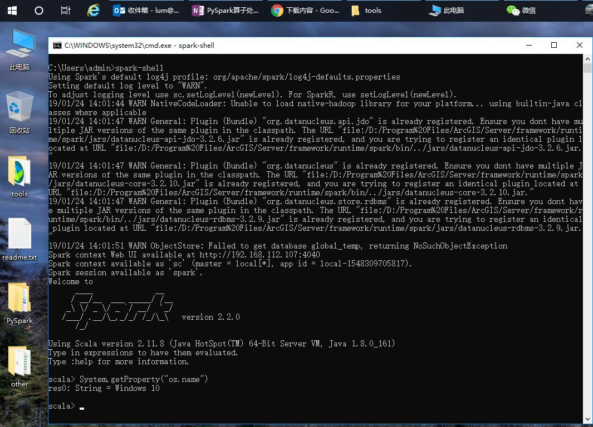

那么在windows里面如何搭建Spark的测试运行环境呢？

实际上Spark运行在Java虚拟机与Scala语言环境下面，这两种东西，都是在任意平台下都可以执行的，所以你只需要在windows上面安装JDK与Scala就可以了。
步骤如下：

- 1、下载并且安装Oracle Java 1.8 的版本（小版本尽量高点，比如161或者181）
- 2、下载并且安装scala，如果追求稳定，就安装2.11或者2.12，追新就安装2.13，注意，2.13对JDK的版本也要求比较高。
- 3、下载，并且解压Spark。
- 4、最关键的一点来了：下载并且解压Hadoop在windows上的模拟依赖文件：winutils（自行百度这个名字）。该文件的应该存放在xxx/bin/winutils.exe，这样的结构下面，那么你的xxx目录，就是hadoop的home
- 5、设置如下环境变量：
    - a、JAVA_HOME ：JDK安装的目录
    - b、SCALA_HOME：Scala安装的目录
    - c、SPARK_HOME：Spark解压的目录
    - d、HADOOP_HOME：上面的winutils.exe所在的bin的上一级目录下，比如你放到：C:\hadoop\bin\winutils.exe，那你的HADOOP_HOME就写c:\hadoop
    - e、设置环境变量的PATH，将你上面的a、b、c的bin，写入到path里面，如下所示：
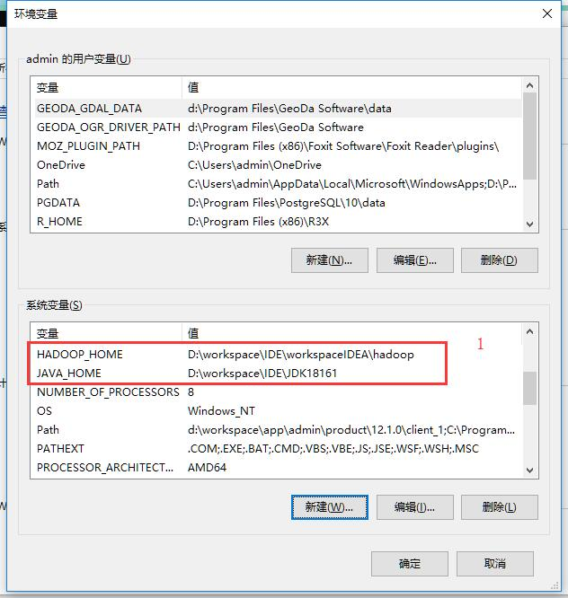

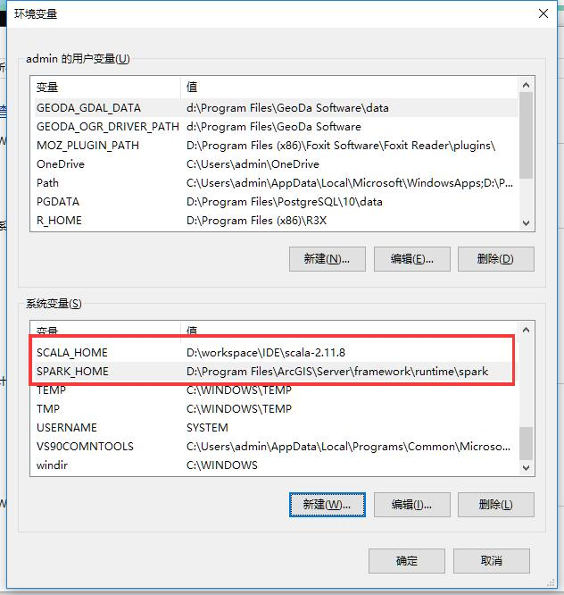

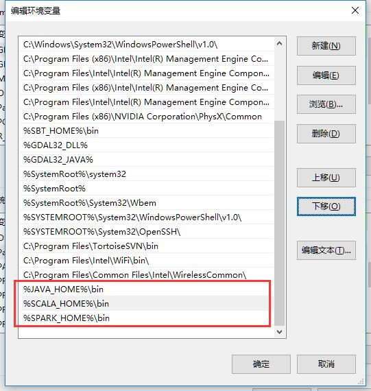

全部设置完成之后，打开cmd窗口，输入spark-
shell，如果出现如下界面，表示部署成功：
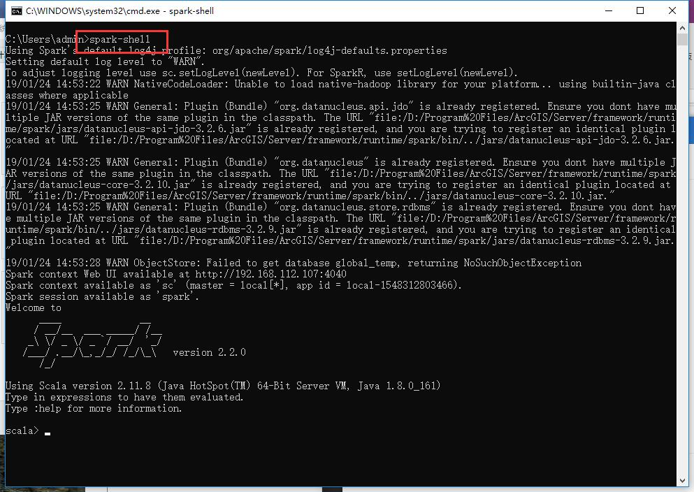

## 注意：我这里使用的是ArcGIS自带的Spark，如果是自行安装的Spark，效果是一模一样的，不用去纠结版本的问题。

接下去，就是PySpark的部署了。

先看看PySpark是是嘛东西。

Spark很强大，但是Scala不好学（如果你要做Spark开发，建议还是学习一下Spark，但是如果你就是用用，那么就没多大必要了），幸好Spark支持用Python来对他进行原生的调用。用Python来调用Spark的包，就称为PySpark。

网络上有很多关于PySpark的介绍了，我这里就不赘述了，那么Python是怎么调用Spark的呢？核心在于这样一个包，叫做Py4j。这包的作用就是通过Python来调用Java虚拟机中的JAVA对象，所以实际上来说，PySpark核心还是调用的是Java，而并非是Python原生态的对象。

如何使用PySpark呢？建议大家直接使用Anaconda Python 3来调用PySpark。

首先安装Anaconda Python3版本：

安装完成之后，直接通过conda或者pip安装py4j，安装完成之后测试一下Py4J是否可用了：
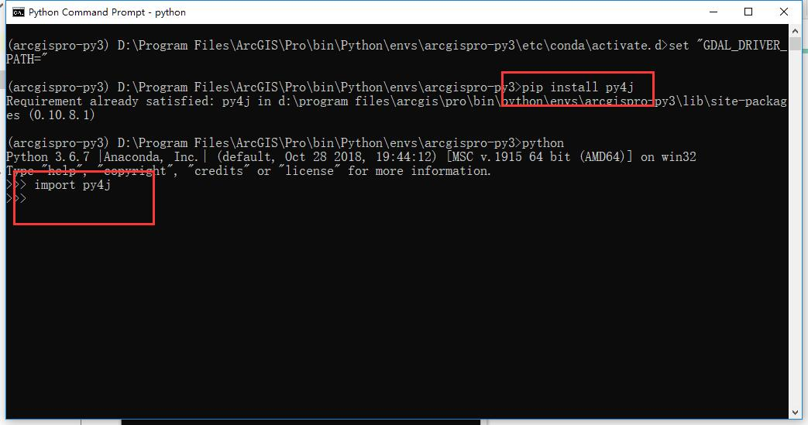

之后，就要设置PySpark包了。PySpark的位置在你Spark的目录下面，比如我的在这里：
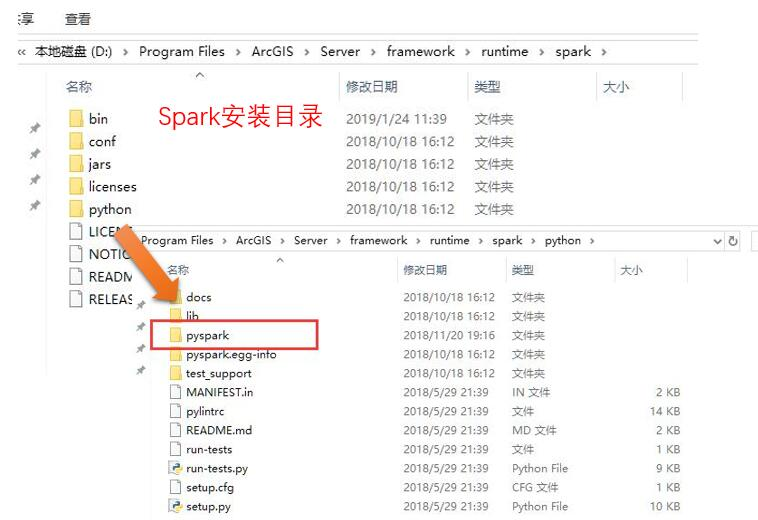
找到了之后，就可以把这个路径设置到你的Python环境里面了，主要方法有很多，这里介绍做简单的一种，就是制作pth文件：

- 1、找到你的anaconda

    Python的安装目录，找到Python站点包的位置：如果有env，就找到env里面，比如果你默认安装的是anaconda的话，应该是在D:\ProgramData\Anaconda3\Lib\site-packages下面，如果有env，就应该在env/<虚拟环境>/Lib/site-packages下面：
    

- 2、在下面创建一个文本文件，把后缀名改为pth，如下，比如我的名字就叫做pyspark.pth
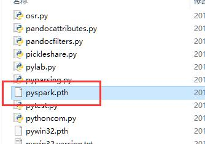

- 3、用记事本打开，在里面写上你Spark下面的python的路径：
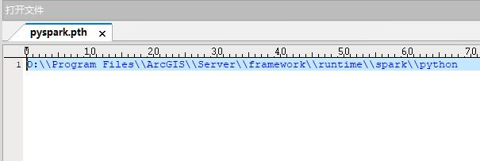

- 4、保存——退出。

然后我们来测试一下PySpark在我们的Python环境中是否可用了：
打开Python，然后输入import pyspark，如果不报错，就表示成功。
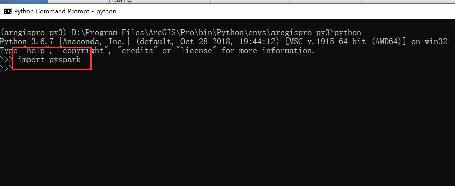

### 如果出现了错误，多半是你pth里面的路径设置不正确，注意使用双斜杆。
之后就可以用同jupyter来进行pyspark开发了，下面建立一个jupyter notebook，来测试一下pyspark：

最后需要源代码的同学，可以到虾神的代码托管仓库去自行下载：

https://gitee.com/godxia/PySparkDemo

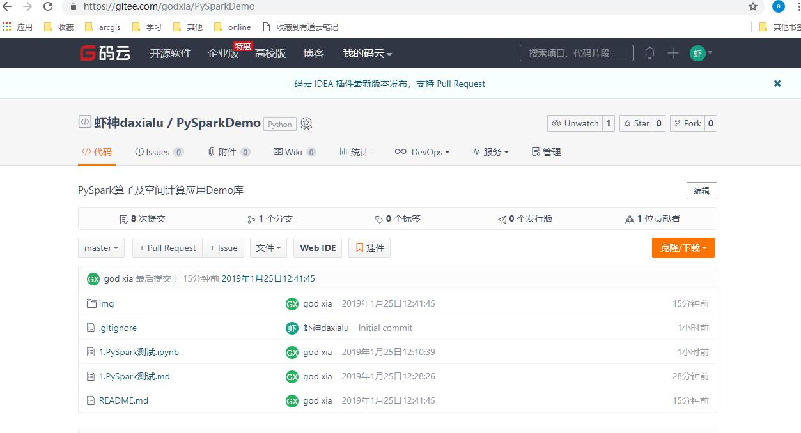

待续未完

