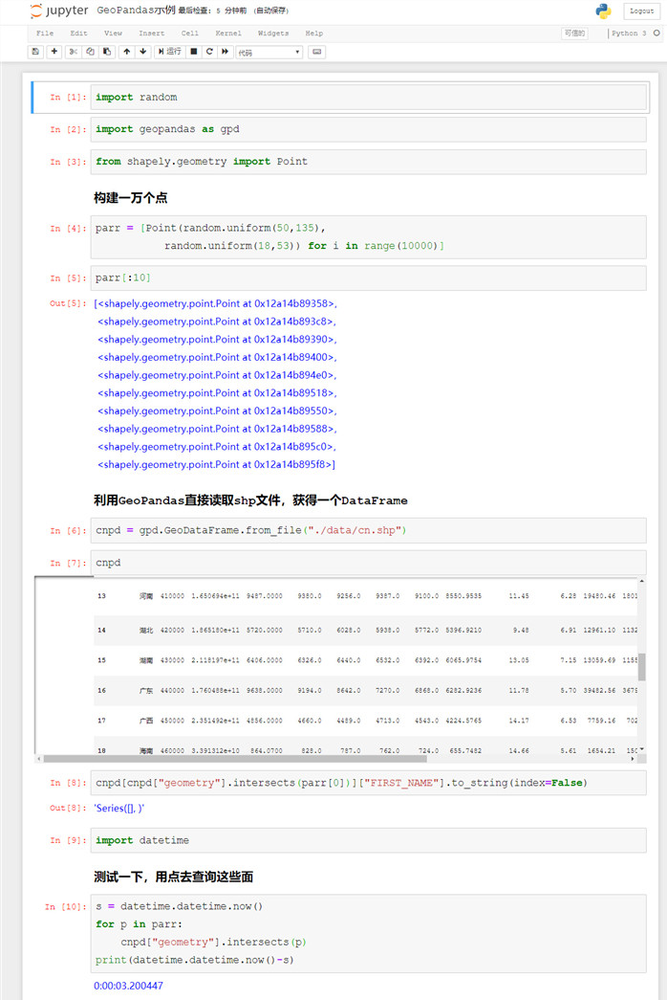
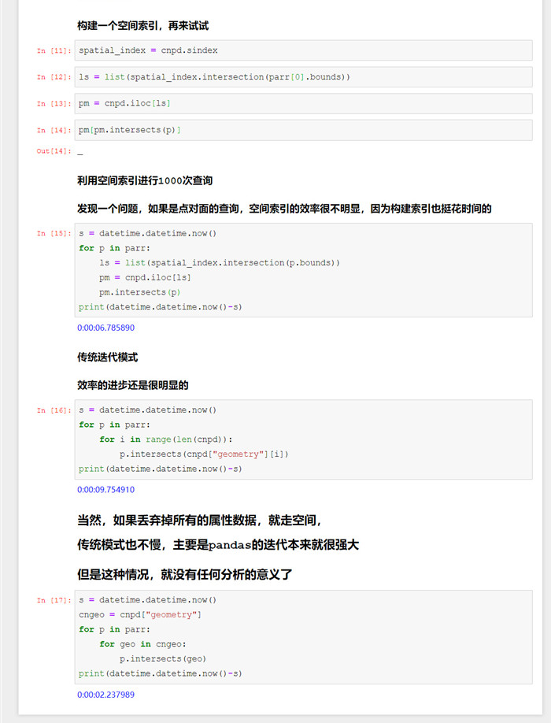
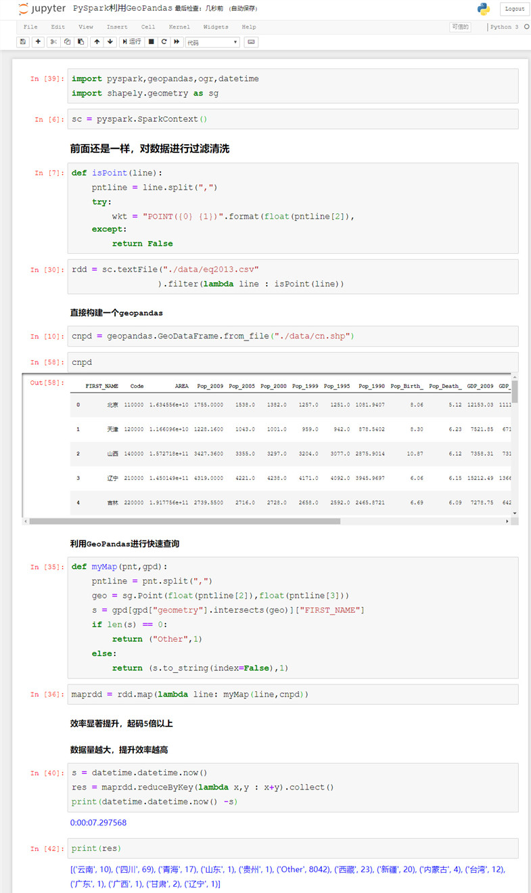
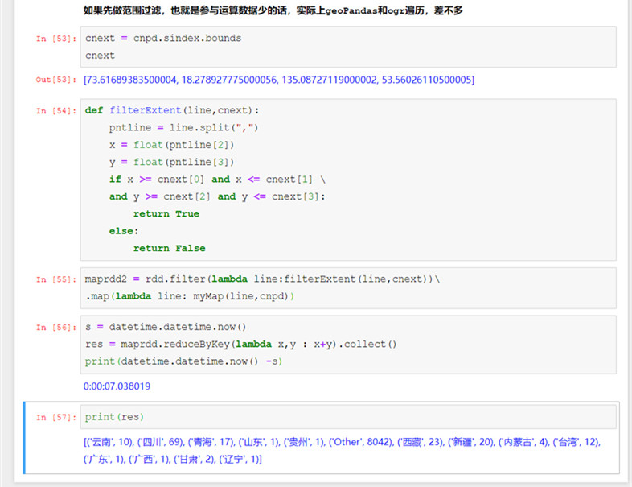

# PySpark算子处理空间数据全解析（12）外篇：
# 在PySpark使用geoPandas及空间索引

上一篇我们用最简单粗暴的方法进行遍历，短短的几千个点对几十面的计算，居然用了40多秒，可见暴力遍历实际上是一种效率非常低的方法。

空间数据的快速查询，主要是通过索引来实现的，而空间分析发展了几十年，空间索引技术已经很成熟了，正如我一直强调的，我们没必要去自己造轮子，直接拿来主义就行。

有同学问，空间索引怎么用？这个问题问得好：

GeoPandas可以快速的构建一个支持空间数据运算的DataFrame，然后利用这个DataFrame就可以快速进行查询了，看下面的例子：

上面是一个简单的GeoPandas的例子，模拟10000个点对32个多边形进行相交查询，

GeoPandas是支持空间索引的，但是点数据对面数据的选定，实际上去独立构建空间索引没有多大意义，构建的开销比计算还要大一些。

但是对比传统迭代模式，就要快很多了，但是如果丢弃掉属性数据，单纯进行空间数据的对比，还是挺快的，这个主要是Pandas的切片带来的效率开销，有兴趣的同学自行了解一下。

不过如果仅有空间数据，把所有的属性信息都丢掉的话，那么分析也就没有任何意义了。

下面来看看geoPandas在PySpark里面如何去使用：

可以发现，效果非常的拔群——比传统粗暴的迭代，5倍效率的提升。但是如果参与运算的数据量少的话，GeoPandas的优势就不大了，毕竟DataFrame的切片也是需要开销的。

待续未完。

示例中的代码，可以到虾神的github或者gitee上去下载：

Github:
https://github.com/allenlu2008/PySparkDemo

gitee：
https://gitee.com/godxia/PySparkDemo
