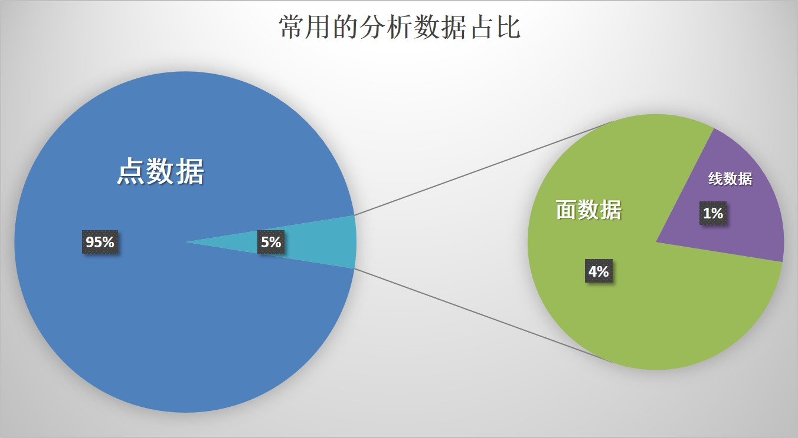
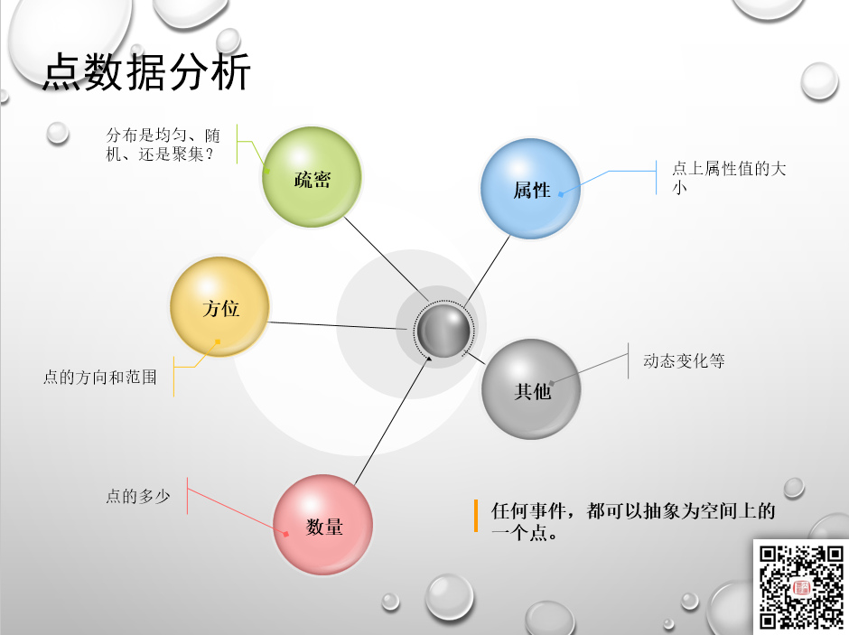
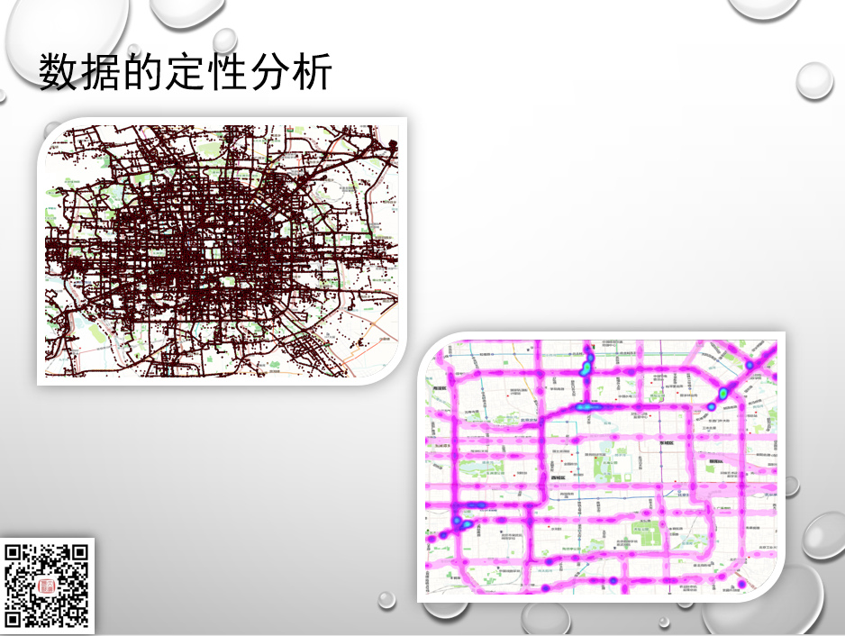
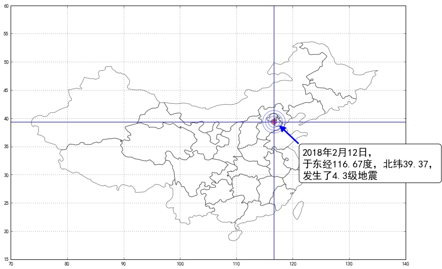
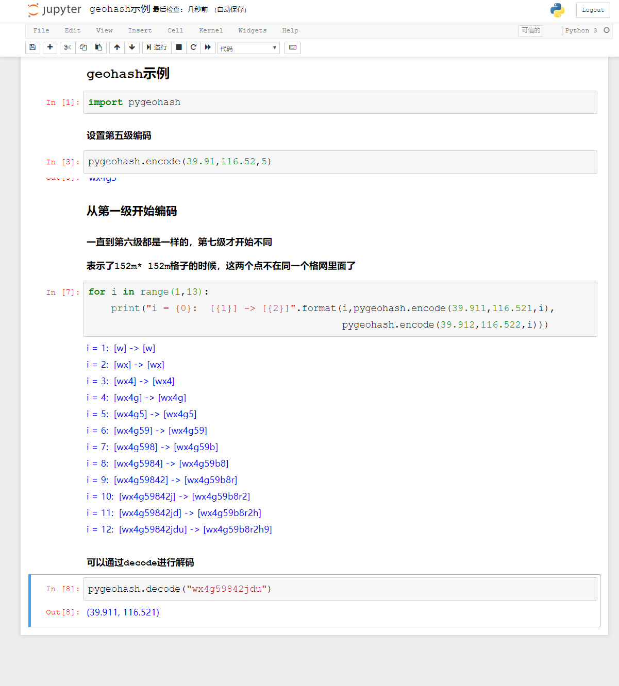
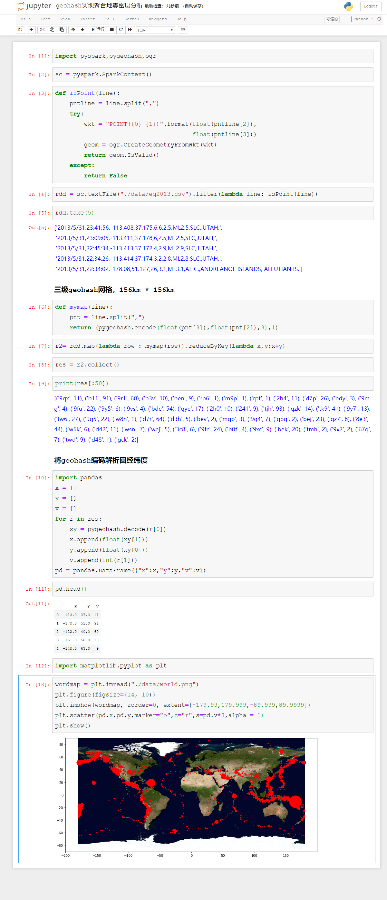
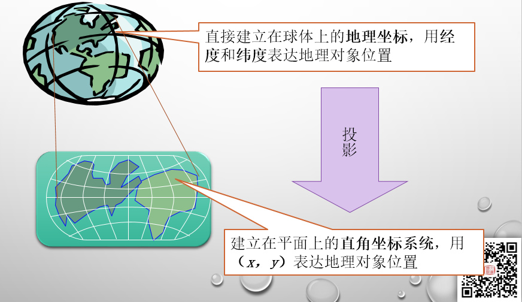
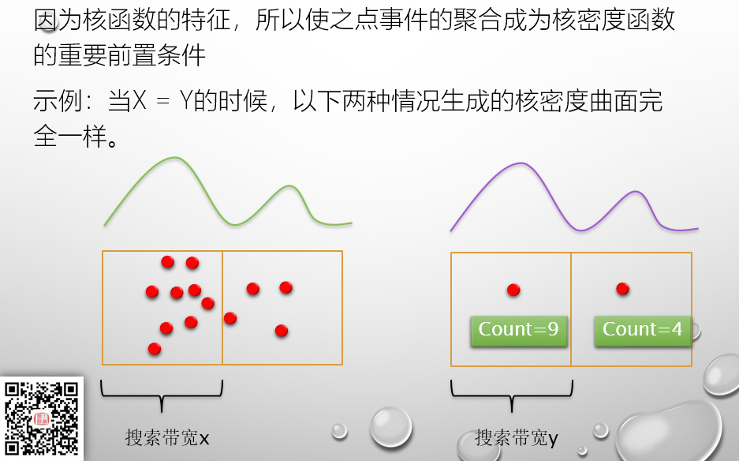

# PySpark算子处理空间数据全解析（13）外篇：
# 经纬度数据利用GeoHash进行聚合统计

点数据的分析是空间大数据的主要分析模式：

点分析一般有如下分析内容：

而点分析最常用的算法就是点聚合：

比如在轨迹数据中，任意一个点独立拿出来，都没有任何的意义，比如要了解某个路段某个时间的交通状况，就需要把研究区域内所有的点都进行综合计算，或者用众数，或者用平均是来代表这个区域的基本情况。

所以，点聚合是点数据分析中最常用分析手段。

而我们能够快速获取到的点数据，一般都是LBS（基于位置的服务）数据，基于位置的话，90%以上，都是以经纬度模式进行表达的。

如果数据是经纬度的话，有个非常简单实用是算法，叫做GeoHash：

GeoHash的原理就是按照区域，把经纬度进行编码，按照不同的网格精度，变成不同位数的编码，在同一区域中的编码相同。

比如上图里面的那个例子，如果两个坐标的前6位相同，那么表示在第六级精度格网上，两个坐标处于同一个格网。这样，我们就可以按照编码的内容，按照不同的精度聚合位置点数据了。

GeoHash的网格精度如下：

比如我们要按照152m*152m来设定一个区域，那么设置生成七位数的geohash编码即可，如下面的例子所示：

GeoHash可以让我们快速的对点数据进行聚合，下面我们来看看如何使用GeoHash算法配合PySpark，来对地震数据进行快速聚合统计：

从上面的代码可以看出，如果我们要按照152公里的网格进行聚合，只需要用三级编码就可以了，实际上与以前说过的整除截余法的原理是一样的。

GeoHash能够最大的限度简化网格聚合的算法，但是也有一定的限制，主要的限制就是geohash编码的网格大小是固定的，如果我们要实现100米或者500米网格聚合，就没有办法直接用了。

当然，如果你真的要搞什么500米网格，首先不是要考虑的是geohash，而是考虑先选择一个什么样的投影坐标系——经纬度转换为米本来就是需要进行投影了，而一旦投影之后，你就可以采用整除截余法来进行聚合。

实际上已经说了好几篇的聚合，有的同学可能也有一个疑问：为什么你老在说聚合，难道点数据分析就做聚合就可以了么？

当然不是，但是聚合可以是我们处理数据的一个基本手段，比如要做核密度分析，因为核密度的一个特性，使我们做聚合成为核密度分析的重要前置条件，这个问题，以后我们再说。

待续未完

## 代码下载：

Github:
https://github.com/allenlu2008/PySparkDemo

gitee：
https://gitee.com/godxia/PySparkDemo