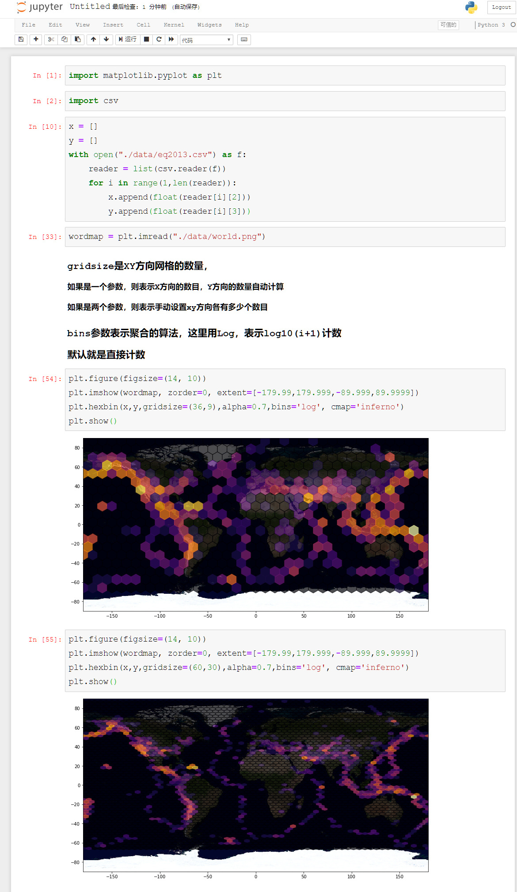
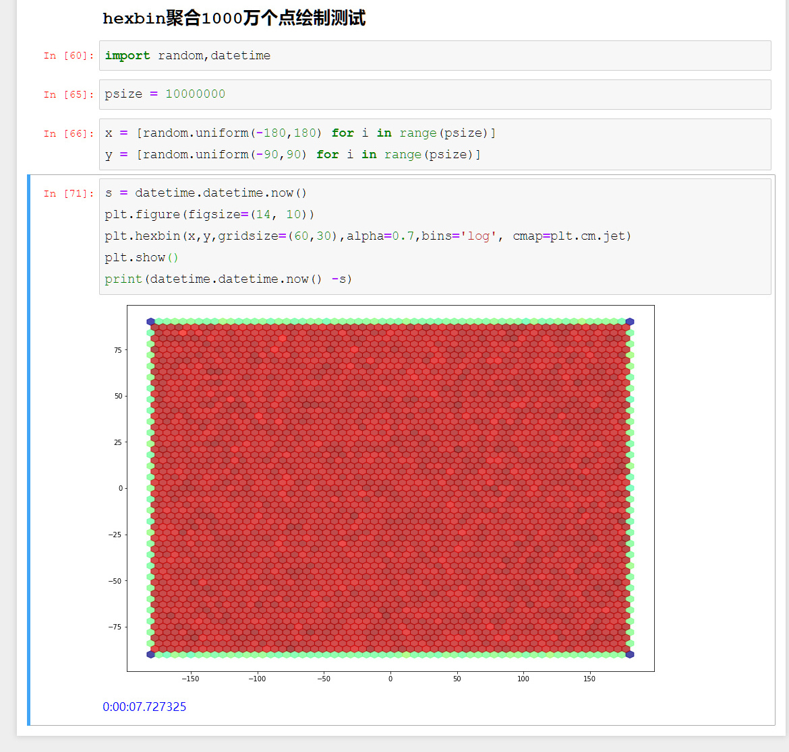
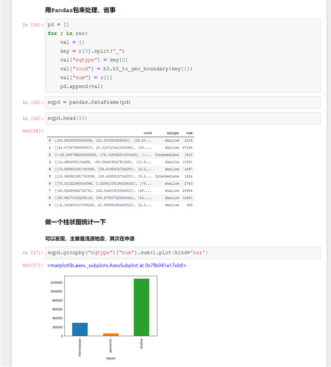
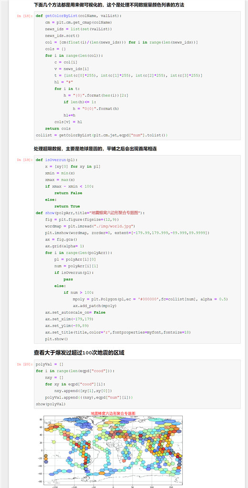

# PySpark算子处理空间数据全解析（14）外篇：
# 经纬度数据利用Uber H3进行聚合统计

以前曾经写过一篇Uber H3算法相关的文章，大家有兴趣可以翻一下：

Uber H3算法实现蜂窝六边形聚合

顺着上一篇文章既然说了GeoHash，那么今天也顺便说说在PySpark里面怎么用H3做一下六边形聚合统计。实际上看过上一篇文章的同学不用我说大家也都知道怎么做了……无非就是选择一个聚合的尺度，然后做Map，在做reduceByKey嘛……

实际上，如果你仅仅是要来做一下蜂窝格网密度的可视化，数据量少的情况下，根本不用PySpark什么的，在Python的matplotlib包里面，直接有hexbin，可以直接进行蜂窝密度分析，如下所示：

如果就从可视化角度来看，基本上也就够用了，而且关键是matplotlib这个包，从2.x重新构建之后，效率还挺高，比如我做了个1000万个点的聚合测试：

在我的机器上，只需要7秒多就完成了聚合和绘制了，极其厉害。

但是可视化仅仅是数据分析最初始的手段，很多时候，不但要能够可视化出来，还需要有后续的分析，比如做空间聚类或者做深度或者广度的钻取。

下面我们通过PySpark + H3 来实现全球地震分析，进行分源分区的统计：

统计完之后，还可以用matplotlib可视化一下看看效果：

可以看出，整个分析计算的方式，与geohash基本一致，而且保留下来之后，你还可以把数据写成Shapefile，就可以进行更进一步的做空间分析了，写数据为shapefile相关内容，可以看看ArcGIS或者GDAL的相关接口，不是这里的内容，所以这里不做多说。

### Github:
https://github.com/allenlu2008/PySparkDemo

### gitee：
https://gitee.com/godxia/PySparkDemo