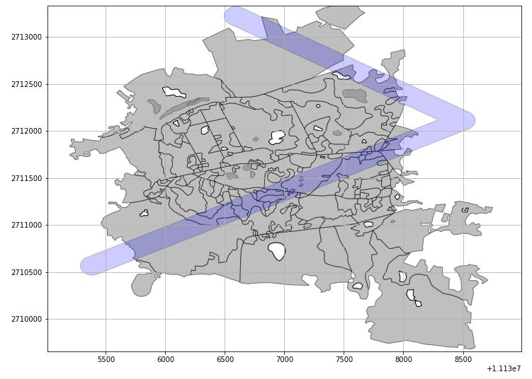
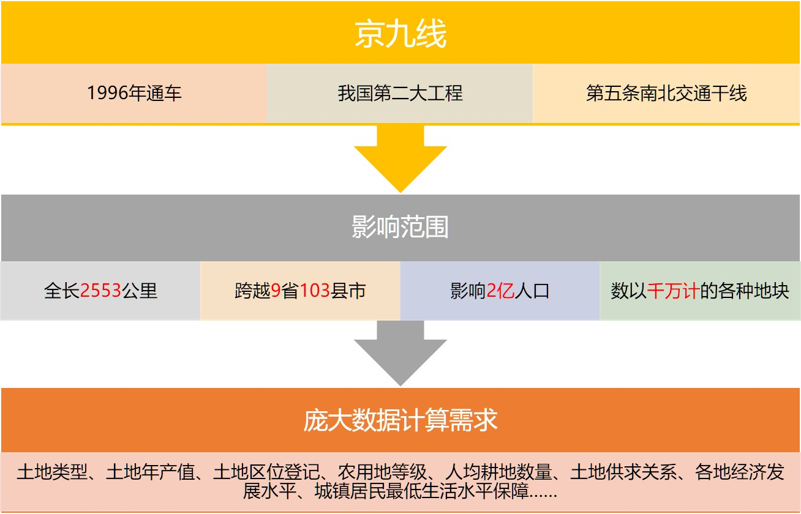
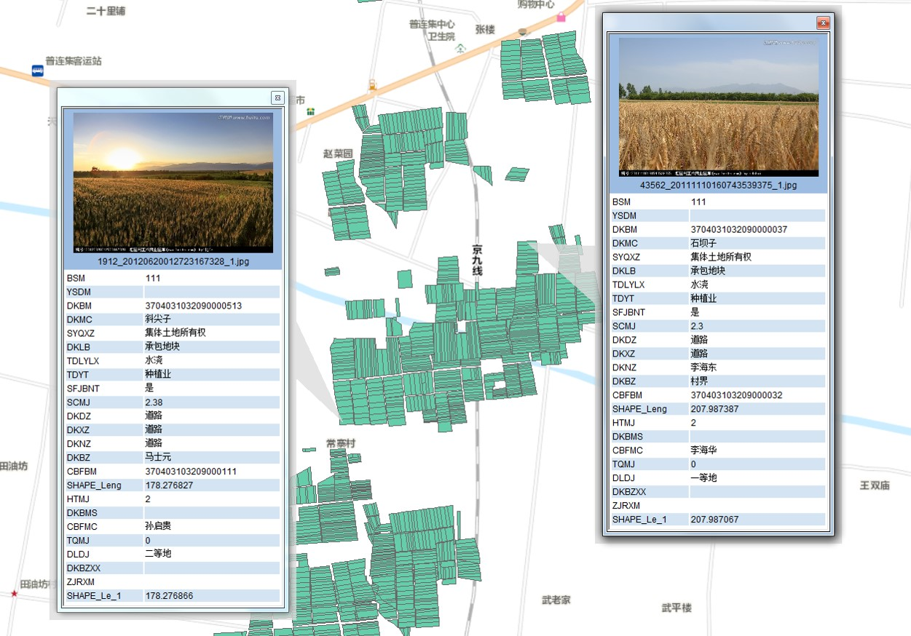
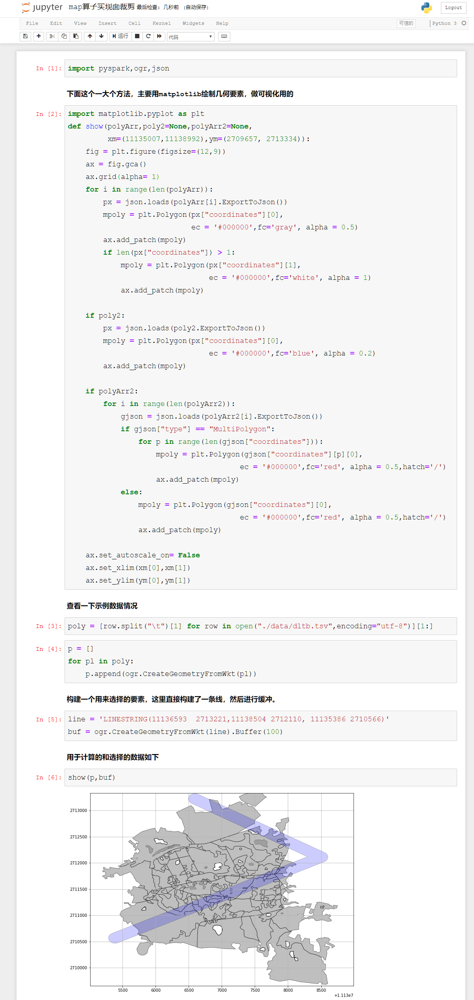
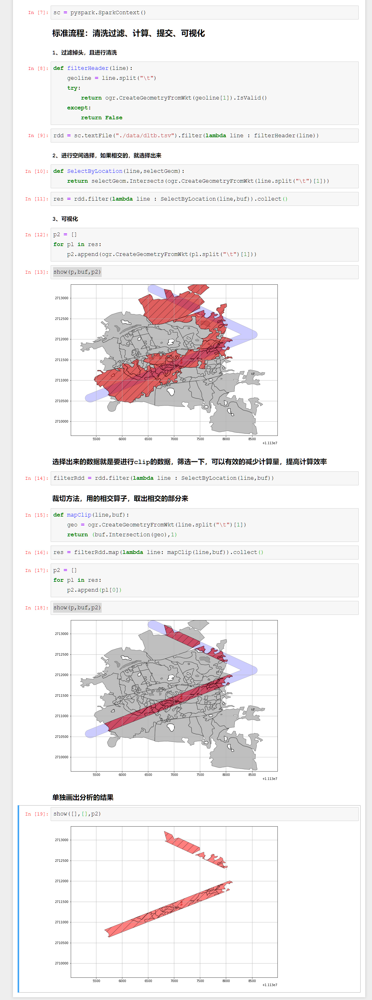

# PySpark算子处理空间数据全解析（15）：
# 利用Map精确裁剪面状要素

Map是Spark最重要的一个算子，没有之一。所有的transformation算子，基本上都可以用map算子来替代，可以说Map算子实际上是Spark的始祖级算子（废话——人家本来就来源自MapReduce算法，顾名思义嘛）

前面我们实际上已经做过了利用filter算子对空间数据进行过滤，实际上在提取数据是属于数据生产的主要工作之一，也就是按照条件从相应数据中选出符合需求的数据。但是在空间上，有些数据的的提取是需要生成新的数据的，比如修一条路，需要征用土地：

征用土地就要收费，而如果你这样征用的话：

你是不会觉得：

所以涉及到RMB的东西，那是一点都不能多的……

那么怎么来做精确裁切呢？小数据量好说，所有的GIS软件都内置了Clip功能，但是我们要考虑的是超大数据量，比如从全国几亿个地块里面，裁剪出京九线沿线地块这种操作：

一次裁剪，如果用传统工具，那就是以天为单位……那么如果要做不同缓冲尺度的裁剪，那么无论是分析计算所用的时间，还是生成的结果所用的存储空间，都是一个极其庞大的量。

所以这种级别的运算，就可以考虑使用分布式计算了，那么算法如何写呢？如果掌握了Map算子的话，那是灰常的简单，不信？LOOK：

可以看出，只需要在map方法里面，做一个简单的处理，就把需要裁切的内容处理出来了，如果后续还需要继续分析，那么只需要把这个内容写成shapefile，或者写入数据库，就可以继续使用了。

从以上流程可以看出，map实际上可以处理所有需要迭代的内容，然后把处理的结果直接生成为新的RDD就可以了，如果这也就是MapReduce的编程核心，如何构建合理有效的map。

可以说，掌握了Map，基本上就大半掌握了Spark的编程精髓了，在以后的应用中，我们还会重复再重复的使用Map来进行处理。

## 以上代码，需要的同学可以直接从下面地方下载：

### Github:
https://github.com/allenlu2008/PySparkDemo

### gitee：
https://gitee.com/godxia/PySparkDemo
