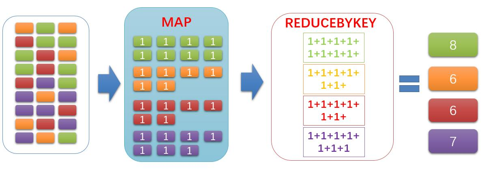
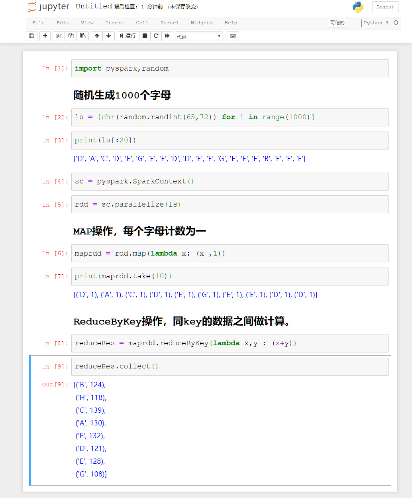
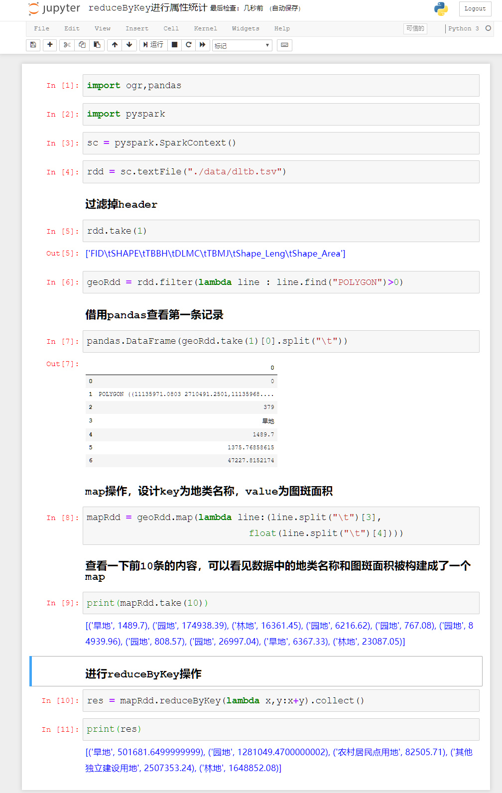
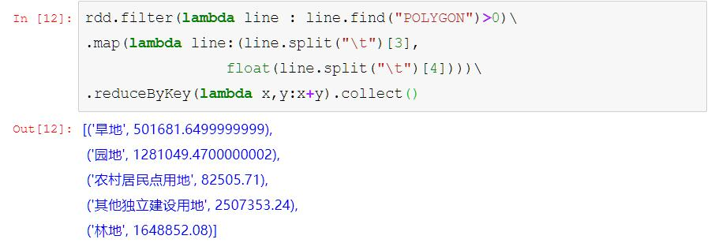
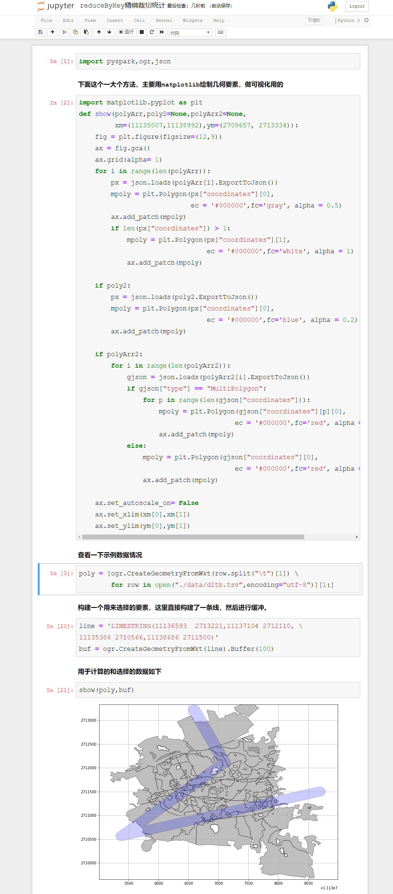
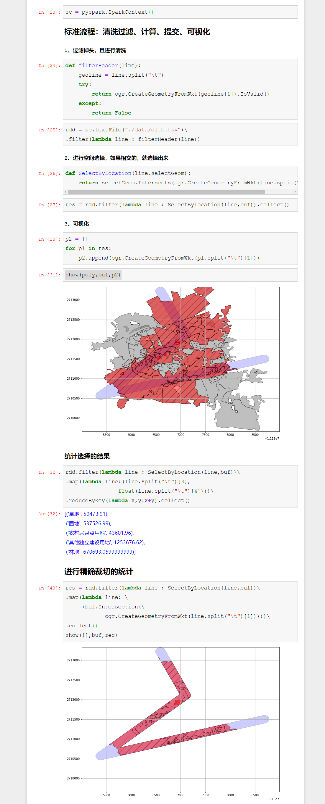
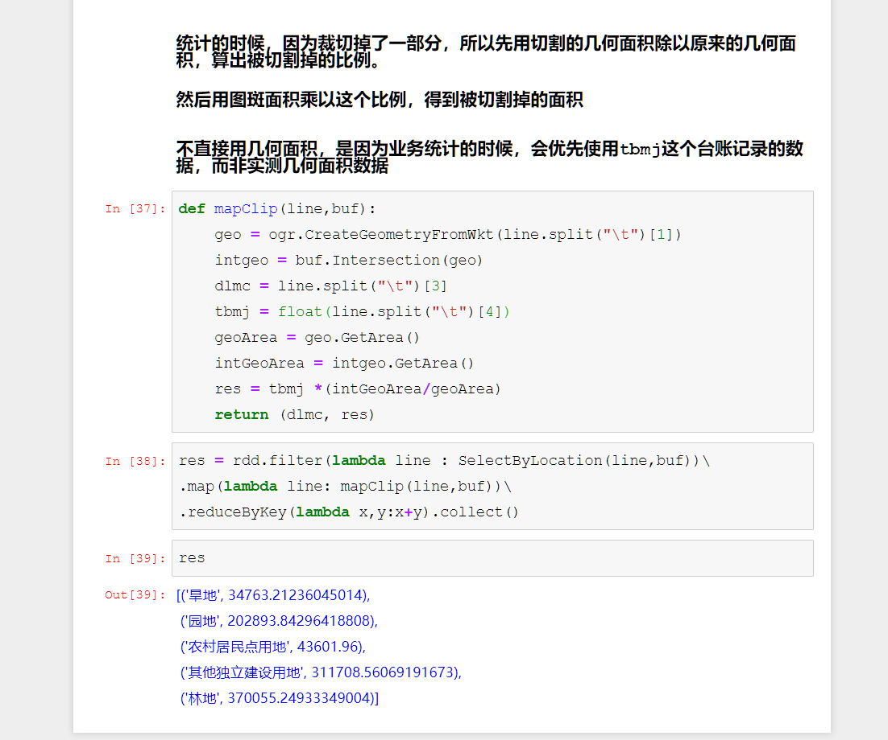

# PySpark算子处理空间数据全解析（16）：
# reduceByKey算子简介（1）

前面的文章，讲了各种map，同学也都发现了，map后面老是跟着一个叫做reduceByKey的算子，是干嘛的呢？或者说，如何去理解它的运行原理呢？

###

正如名称所言：MapReduce算法，reduceByKey也是始祖级的算法。那么今天来说说这个reduceByKey算子的运行原理。

reduce从名字上看，就知道，主要是用来做聚合，比如下面的例子：

看看代码：

reduceByKey，做核心的操作，就是这个By Key了，By key的话，就表示在这个Map中，只要Key相同，就会相互进行计算，而且这些计算是累积的。

这个算子一般都是与Map算子组合起来使用的，一般来说Map负责构建数据结构，ReduceByKey算子负责进行聚合统计。

Spark和Hadoop一类的框架，最早就是用来进行统计分析的，在属性数据进行计算的时候，ReduceByKey是非常重要的一个操作，比如下面这个案例：

在地类图斑的统计中，分类统计应该是最常见的一种操作，类似于SQL里面的group by操作，上面的代码就是实现这一系列的过程，当然，有的同学说，你写这么多代码，SQL只需要一句就行……嗯，要写简单也行，比如上面的代码是为了展开介绍，需要的话也可以写得非常非常简单，把所有代码都集成在一起，也就是写一句就可以了：

最后再来看一个例子，把上篇文章精确裁切的功能和分类统计放一起，来做一个精确裁切统计：

上面的代码，在map里面封装了一个业务逻辑，国土和农业的地类图斑数据，都有台账数据一说，里面的面积记录也有做合同面积、权证面积等，因为历史原因，未必和实际地理面积相同（在历史上，不同地区对地类的分级不一样，按照当年按地征收农业税的定标方法，贫瘠的土地有一亩做五分入账，或者丰沃的土地，有八分做一亩入账等的历史原因，所以图斑面积和实测面积可能相去甚远）。

为了用图斑面积进行计算，所以需要知道，原始地块被裁切掉了多少，所以这里直接计算裁切掉的比例，然后用这个比例系数乘以图斑面积，最后得到结果面积。

待续未完

需要代码的同学，到下面地址下载：
Github:
https://github.com/allenlu2008/PySparkDemo

gitee：
https://gitee.com/godxia/PySparkDemo
