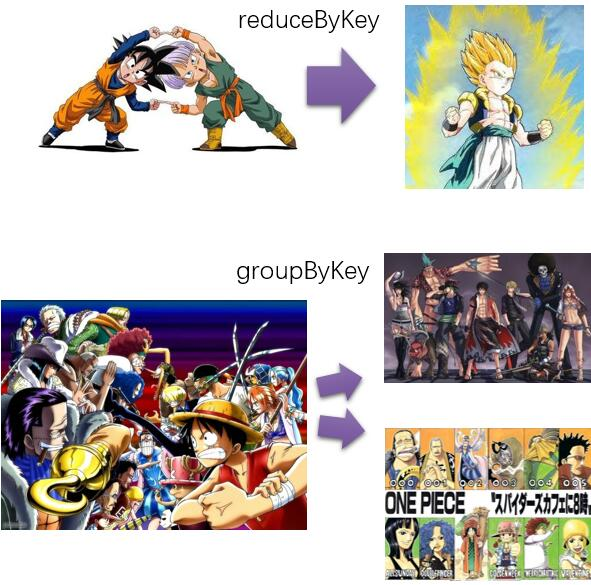
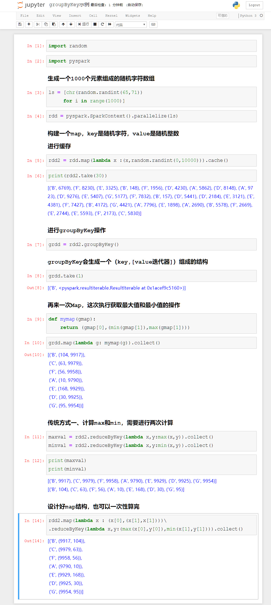
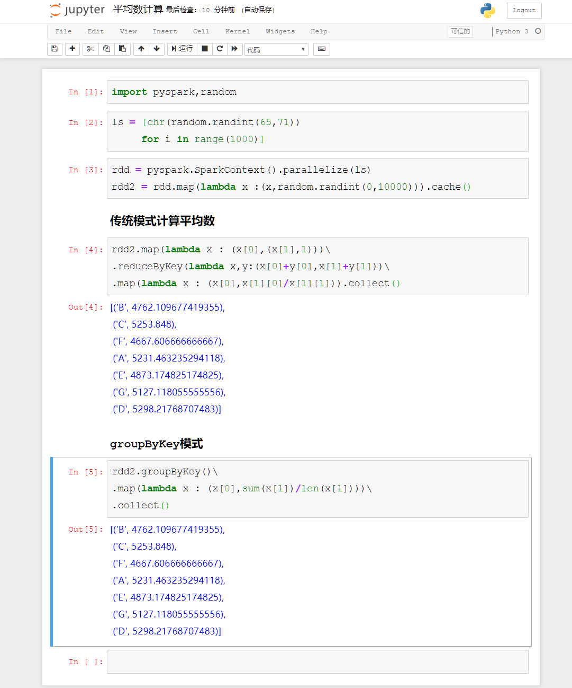
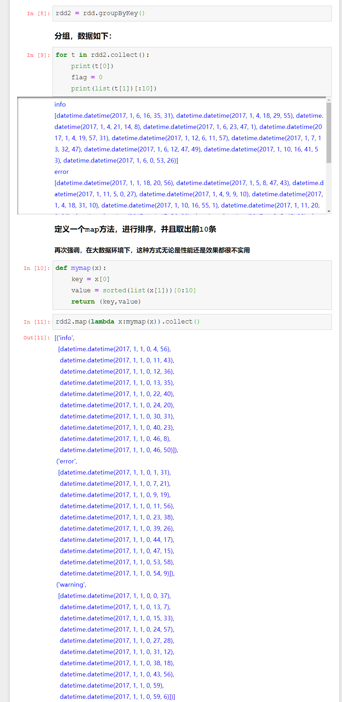
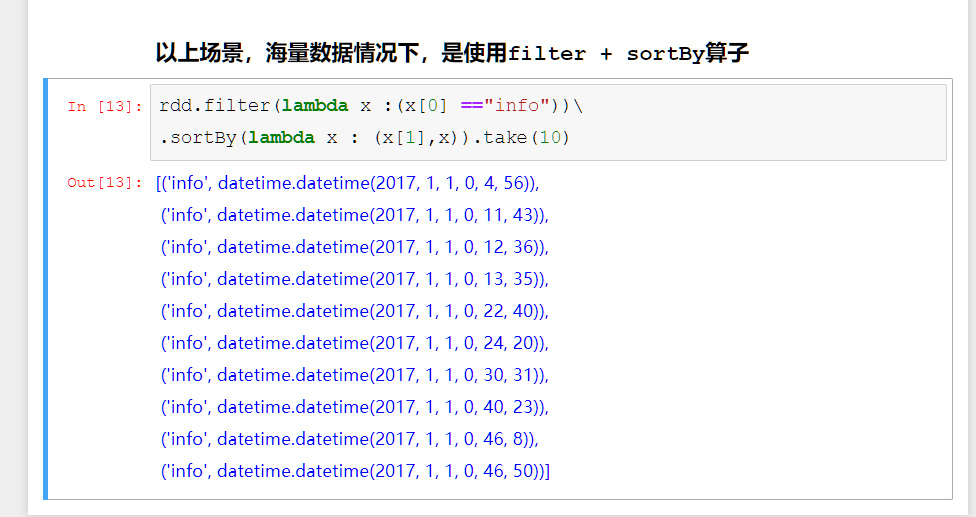

# PySpark算子处理空间数据全解析（17）：
# groupByKey算子解析

上一篇说了reduceByKey，这是一个统计意义用处特别大的算子，本篇再介绍另外一个用处比较广泛的算子：groupByKey。

从名字上看可以看出，reduceByKey是按key聚合，那么groupByKey，就是按key进行分组了。不同的地方在于，聚合是最后输出成一个值，而分组的话，不会把所有值都合并在一起：

有同学会问，分组在一起，有啥用呢？看下面这个例子：

上面的数据结构中，如果要同时计算max和min两个值，那么用reduceByKey的话，传统模式需要计算两次（因为每次只能输出一个值），而用groupByKey的话，因为返回的是原始数据的集合，所以只需要计算一次就可以了。

当然，如果你设计的map结构足够好，也可以一次计算出结果，这就是我我一直强调的：

## 设计合理有效Map的数据结构，是Spark数据分析最重要的内容，没有之一

当然，当然，还有其他的方法也可以做到，比如利用flatmap算子了，此乃后话，暂时不提。

有的同学会问，我有啥必要一次性做多个结果啊，我一次做一个结果不行么？来来来，举个例子，让我们看看，啥情况下才需要一次计算出多个结果捏？

最简单的，就是计算平均数——需要累加和计数两个值，才能完成平均数的计算。

虽然传统模式也很容易解决，但是明显感觉groupByKey的写法更加简洁明了，而且更加易读易理解。

当然，还有一些其他的应用，比如在系统日志统计的时候，我需要看最近发生的10次信息、警告和错误各是什么……或者是最近的20次、30次呢……用Map和ReduceByKey会让你写的死去活来，但是用groupByKey，就各种容易了：

实际上，在我上面的示例里面，海量数据的情况下，性能是非常不好的，因为分组之后，每一组里面的value，可能依然非常非常多，要是多到单个节点无法处理的情况下，那么依然会出现内存溢出。

要处理这种情况，实际上应该使用下面的方法：

上面给出的两个简单算法和示例，可以看出groupByKey，实际上是MapReduce的一种高层的抽象和封装，他能实现的功能，用原生MapReduce算法，设计得足够好的话依然能够实现。但是很多时候，用这个算子，能够简化很多的工作。

待续未完：
需要代码的同学，到下面地址下载：

Github:
https://github.com/allenlu2008/PySparkDemo

gitee：
https://gitee.com/godxia/PySparkDemo

