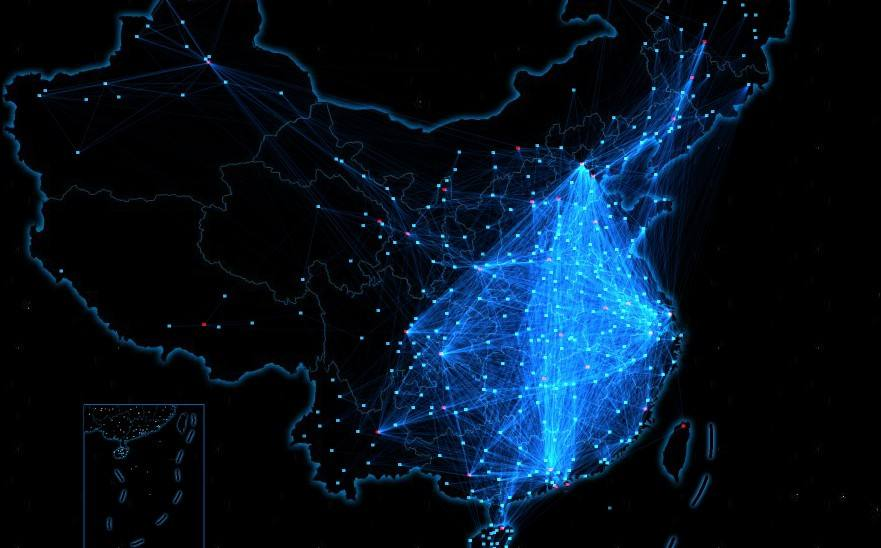
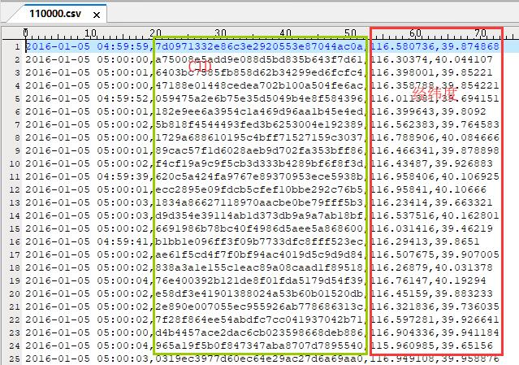
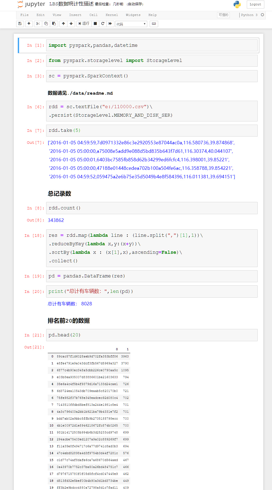
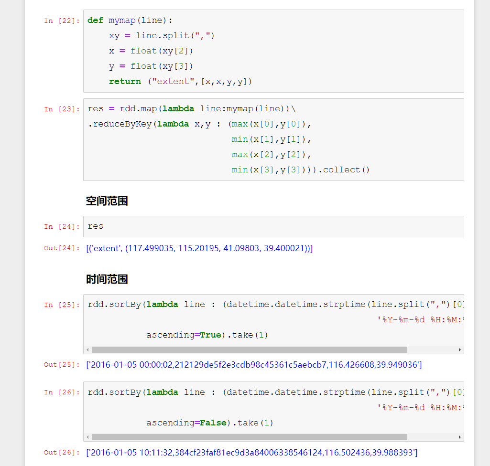
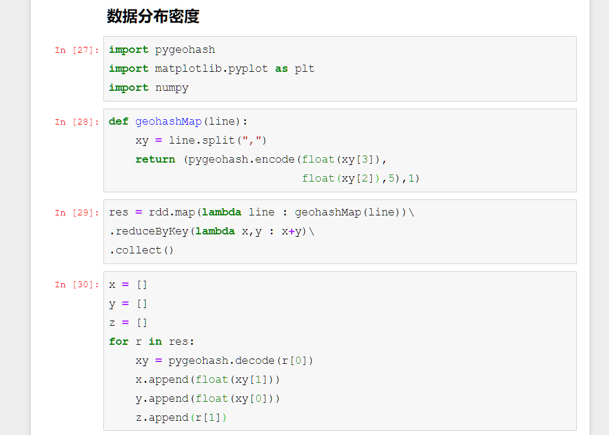
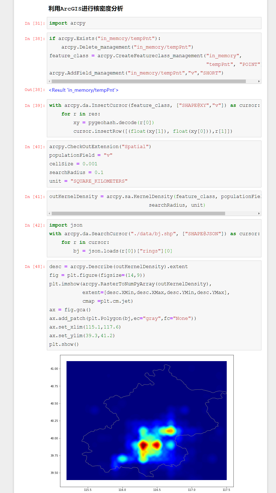
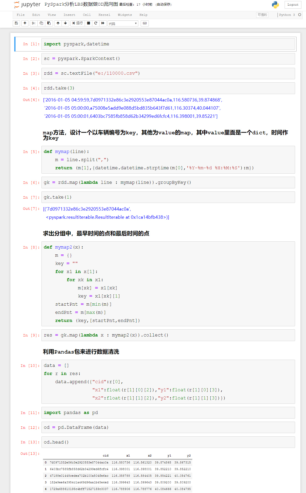
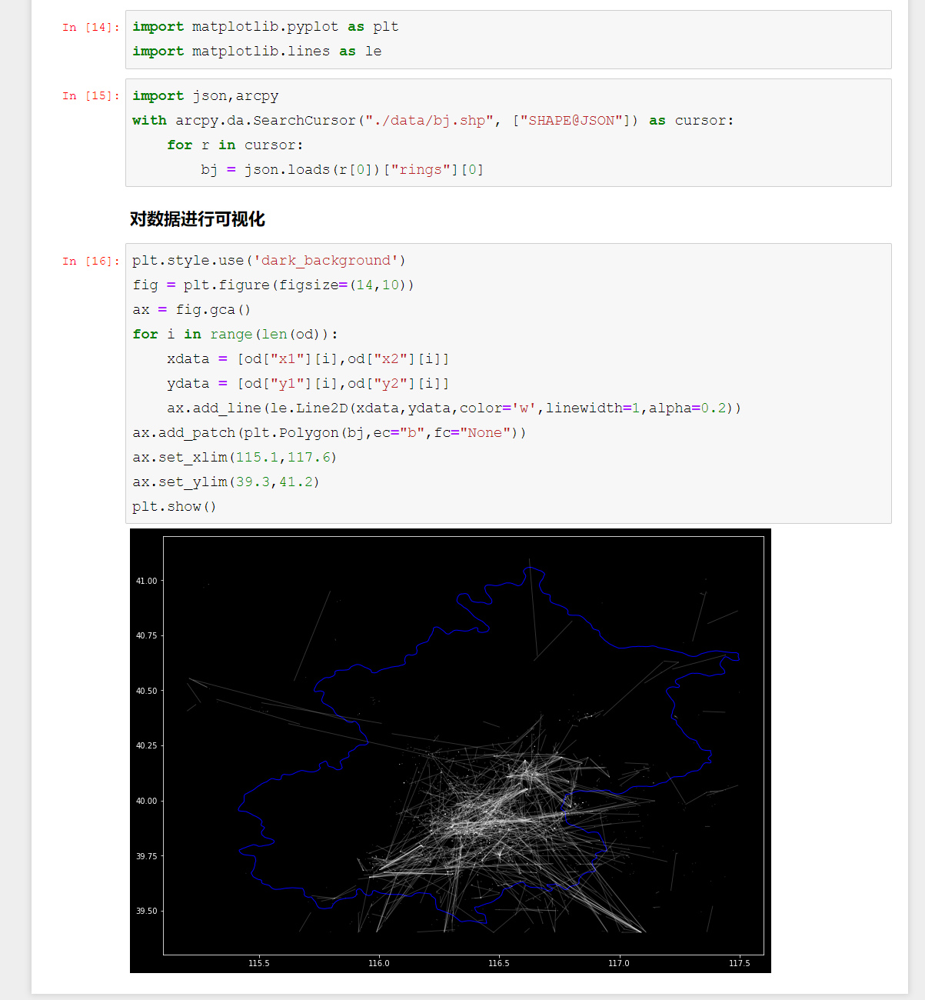

# PySpark算子处理空间数据全解析（18）：
# groupByKey算子实现轨迹数据OD矩阵

上篇说到，可以用groupByKey算子，来计算输出多个值，比之reduceByKey，groupByKey算子能够更细粒度的实现批量数据的业务，当然，reduceByKey也行，只要你设计的算法足够精细，毕竟人家是始祖级算子。

今天我们来看一个案例，就是轨迹计算里面，大家都和关心的一个功能：OD矩阵。

####

啥叫OD矩阵呢？实际上就是把每次出行归类为起点与终点，然后度量每个起点到每个终点区域之间通行量，最后类似于这种效果：

实际上OD矩阵的各种业务算法可以很复杂，但是如果我们手中的是LBS数据，只需要做固定时间区间的OD流量，就非常简单了，比如下面的数据：

CID一列，是车辆的ID，为了脱密，用了UUID，time是当前的时间，后面是经纬度。下面先对这批数据做个简单的描述性统计：

可以看见，数据主要集中在北京的城六区，下面我们先来做一个简单的移动连线，也就是把每辆车的首点和最后一个点提取出来，然后做连线：

这样，由起讫点组成的流向线就绘制完成了，实际上在OD矩阵里面，很多时候是有区域选择的，比如研究几个城区之间的车辆流动，或者是外地进京车辆，车辆离京情况、工作区——住宅区流动（职住分析）等等，还有就是各种时间分辨率的切片，但是万变不离其宗，只要掌握了最基础的算法，其他的无非就是在这个算法上加载各种条件罢了。

待续未完

需要代码和数据的同学，到下面地址下载：

Github:

https://github.com/allenlu2008/PySparkDemo

gitee：

https://gitee.com/godxia/PySparkDemo

