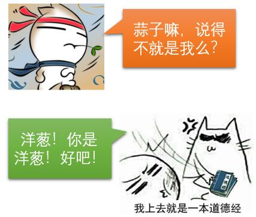
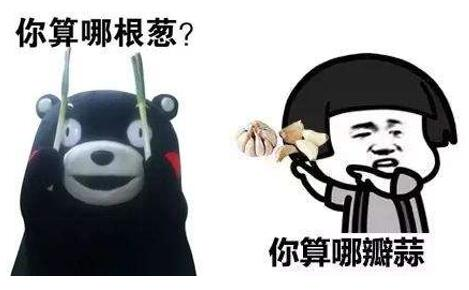
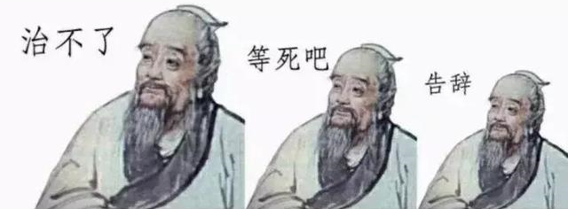
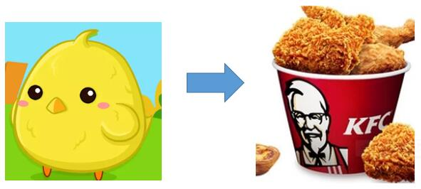
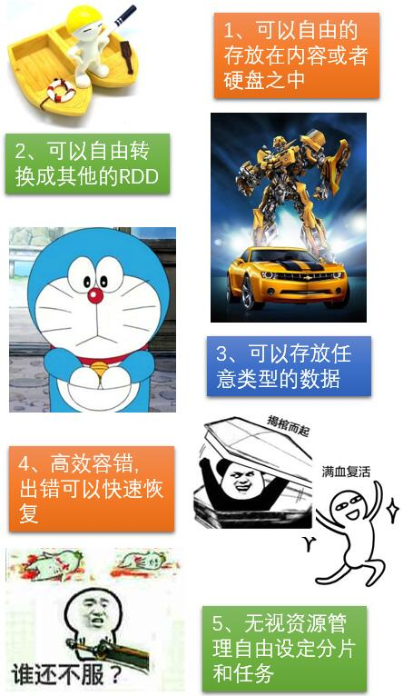
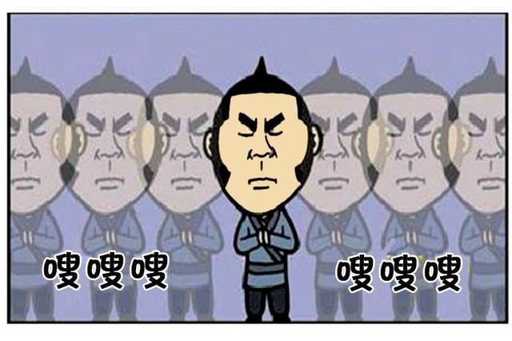
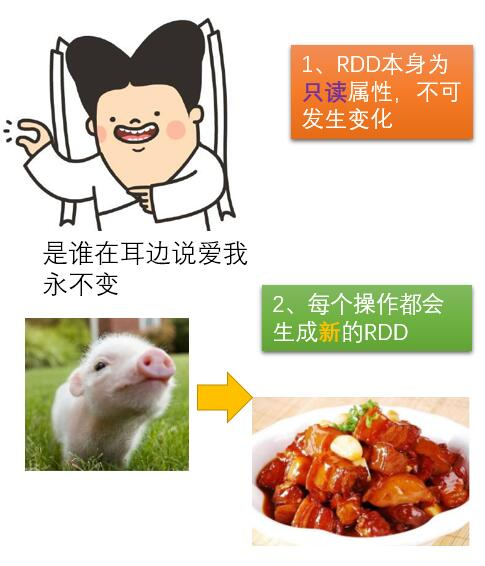
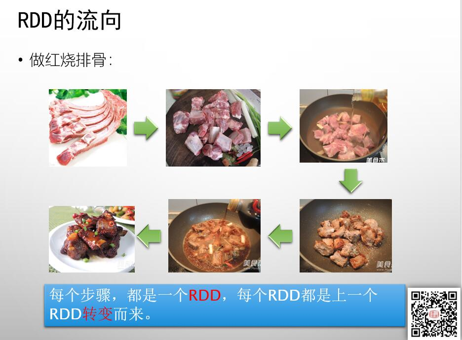
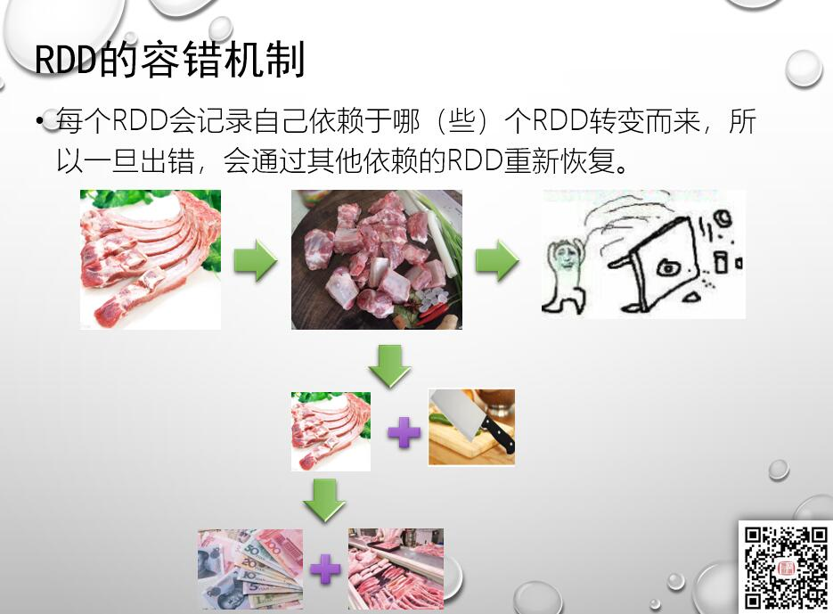
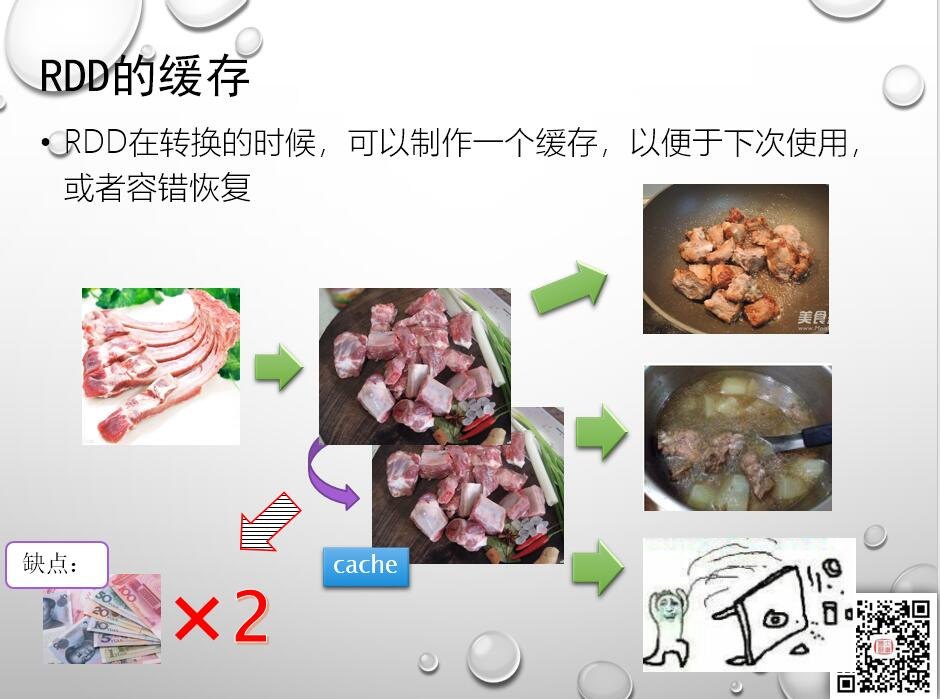

# PySpark算子处理空间数据全解析（2）：
# 啥是算子（1）：RDD

说到蒜子嘛，不就是：

额，不对啊，那蒜子就应该是：

那么我只能表示：

那么，到底什么是算子呢？

算子实际上Spark里面的一种专业术语，实际上就是一种函数，但是与传统函数不一样的是，它进行的状态的转换。比如：

将小鸡变成KFC全家桶，之间就有好多个步骤，那么每个步骤实际上就是一个算子。

要说算子，首先就要先说说Spark里面的一个核心概念：
## RDD

RDD的全称叫做“弹性分布式数据集”（Resilient Distributed Dataset），网络上关于介绍它的东西海了去了，我这里就不赘述了，总体来说，他有如下几个特性

### 1、弹性：
弹性这个词，这里实际上说的数据的灵活性，包括了一下这些能力：

### 2、分布式：

要分析的数据会被分散成若干块，存放在不同的work节点上，进行处理。

### 3、不可变：

RDD作为Spark的核心内容，掌握了RDD的操作，就等于掌握了绝大部分Spark的应用方式了。下面我们通过一个具体的例子来说明RDD变换流程，比如红烧排骨的做法：

每一个成品，就是一个RDD，而每一次变换，就是一个算子。

比如第一个步骤，是整扇的肋排，通过“切”这个操作，变成了小块。那么在这个操作里面，整扇的肋排，就是初始的RDD，算子就是“切”这个操作，转换而成的一个新的RDD，就是变成了小块的排骨。

第二个步骤也是一样，小块排骨这个RDD，通过焯水这步骤，变成去掉了血水的半熟品。这里初始的RDD，就是上一个步骤转换而来的RDD，这个步骤的算子，就是焯水这个操作，转换而来的新的RDD，就是去掉了血水的半熟排骨。

后面的步骤也都是一样，每个步骤都是由上一个步骤的结果转换而来，每个个转换的操作，就称之为一个算子。

这里我们就可以看见RDD的其中一个特性，就是默认情况下，转换之后，前一个RDD就不存在，比如切块之后，整扇的肋排，就已经消失了，变成了切块之后的小块排骨了。

这样的好处是，Spark本身要处理的数据量就非常庞大，所以通过转换生成的方式，不需要在内存里面驻留多份数据，而且不对原始数据进行改变的话，控制的难度就会大大下降，只需要维护当前唯一状态就行。

但是，这里又带来了一个问题，比如：

刚刚切片好，突然把桌子打翻了怎么办呢？也就是在处理的过程中，RDD出现了错误，没有保留上一步的RDD的情况下，如何恢复呢？

Spark通过血统的方式进行恢复，也就是他会记录下你的RDD是怎么转换而来的，比如：

这样仅需要重复以前的步骤，就可以进行恢复了。

但是如果我们不是仅仅执行一次，比如我们先要做一个红烧排骨，又要做一个排骨汤，那么前面的步骤就需要全部再来一遍，那么这种情况下，如何处理呢？

答案是利用缓存。

缓存的优点是可以多次重复使用和快速容错恢复，但是缺点就是系统的资源消耗会乘以2，那么何时使用缓存，怎么使用缓存，就是一个仁者见仁智者见智的过程了。

通过上面的内容，大家基本上也都可以了解RDD的一些特性了，后面我们讲算子和操作的时候，这些特性还会不断的规范我们的编程思想。

待续未完。
