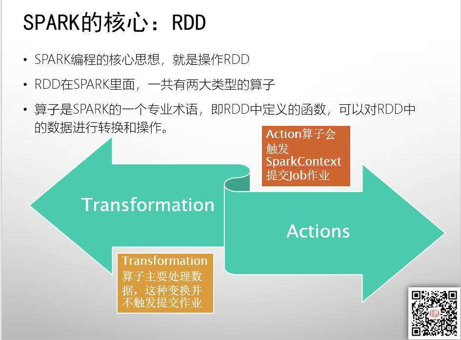
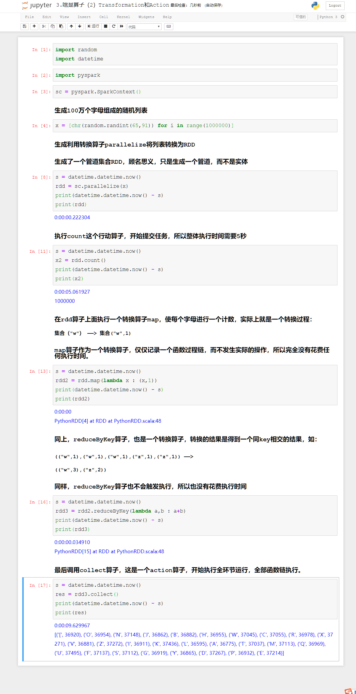
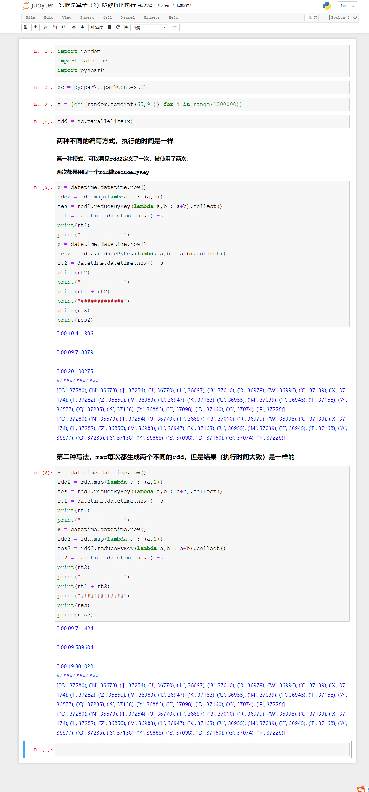
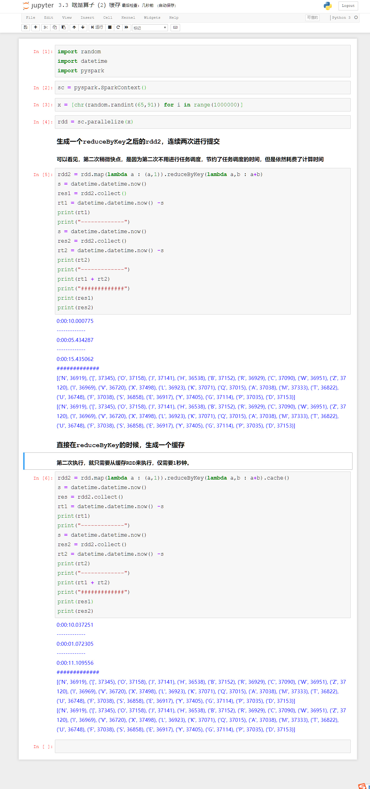

# PySpark算子处理空间数据全解析（3）：
# 啥是算子（2）：转换算子与行动算子

上篇文章说到，算子实际上就是一种操作，在计算机里面就是一个函数，这篇文章说说Spark里面的算子的分类：

Spark里面的算子一共有两种，一种称之为Tranformation（转换）算子，一种称之为Action（行动）算子。

Tranformation算子，主要用来处理数据，也就是进行数据状态的转换，比如上篇文章里面，把排骨切成块，这个切的动作，就是一个一个Tranformation算子。

每一个转换算子，都是得到一个新的RDD。比如把整扇肋排切了，这个转换操作，得到就是一个全新的被切成块的排骨。

那么Action算子是干嘛的呢？
顾名思义，Action算子，主要用来触发提交作业，是真正的执行动作的算子。

从Action才执行操作，那么前面的转换算子是拿干什么的么？

这就是Spark的一个特点了：

Spark的转换算子，仅仅生成一个函数链，记录每个转换操作，但是并不实际执行这些转换操作，只有当出现行动算子的时候，这些操作才开始按照设定的函数链依次执行。

下面我们来看看下面的这个例子：

从上面的案例看出，所有转换算子都几乎不耗费任何时间——因为本身转换算子是不执行操作的，只要到执行算子的时候，才会执行。

如果说上面的例子表示是转换算子不执行，那么下面的例子，就说明了Spark里面，每个RDD都是独立函数链的，因为转换完RDD就不一样，下次要用这个RDD的时候，还得再来一次：

可以看见，两种不同的写法，最后的计算时间都差不多的，

那么我们用缓存的技术，在做一遍看看：

如果不进行缓存，那么第二次执行还是需要进行reduceByKey运算，只是减少了任务调度的时间。加上缓存之后，就不用进行reduceByKey了，直接提交任务进行结果转换就行。

从上面几个示例可以看出，RDD算子里面最核心的两类算子的执行方式，转换算子仅做记录，行动算子提交任务。而如果我们的某一步结果需要重复使用，最方便的方式就是使用缓存。

啥是算子这个问题，到此就讲完了，从下一篇开始，我们进入Spark算子与空间计算的应用。

以上代码，可以通过虾神的github或者gitee下载，地址如下：

# github
https://github.com/allenlu2008/PySparkDemo

# gitee:
https://gitee.com/godxia/PySparkDemo

待续未完。
