# PySpark算子处理空间数据全解析（4）：
# 先说说空间运算

在PySpark中要处理空间数据，就先得说说空间运算的问题。

空间运算就是空间数据之间的运算规则，比如两个面相交：

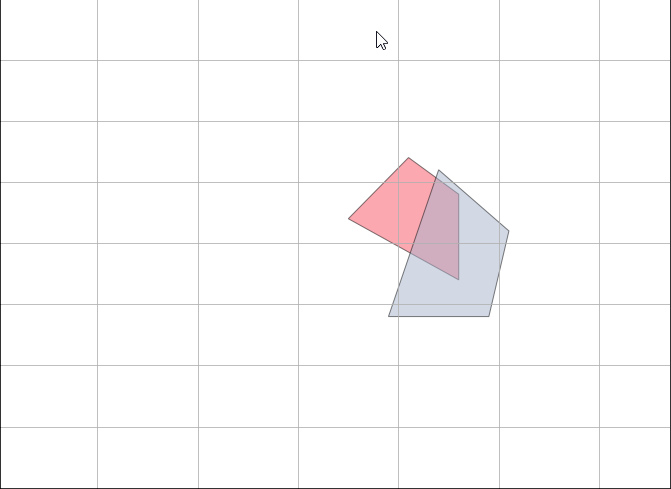

此类计算，一般会有两种情况，一种是判断，是否相交；另外一种就是取出相交的部分来。

所以借用英文语法里面的疑问句形式，把空间运算也分为两类：

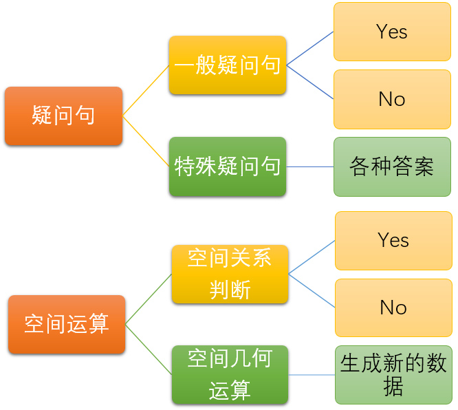

第一类空间运算，对比英文的一般疑问句，实际上是一种空间关系的计算，不会生成新的结果，仅仅返回参与运算的两个空间数据的关系的判断，比如图一的两个面，进行空间关系计算，判断条件为“相交”的话，返回的结果仅会有一个boolean值：True。

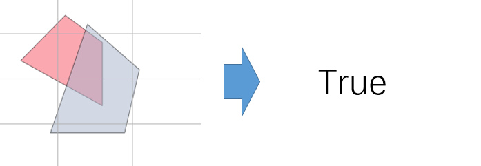

第二类，就是所谓的空间数据分析了，这种分析对比第一类关系运算而已，会生成新的数据；比如图一，分析条件为“相交”的话，如果要求返回的结果为面要素，那么就会把相交的部分给取出来：

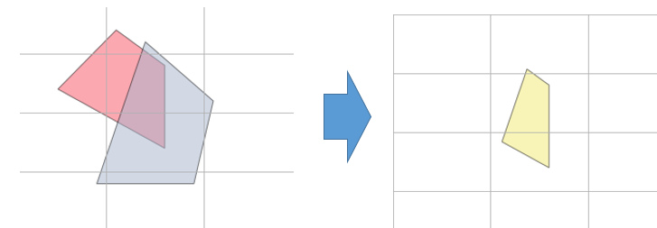

当然，空间关系的算法已经很成熟了，大家有兴趣可以自行去查阅，我们这里不做基础算法的普及，而且也没有必要去自己造轮子，贯彻学以致用的原理，我们仅去了解如何去用。

先来说说目前业界使用最广泛的空间算法库。

在OGC标准（开放地理空间信息联盟(Open Geospatial Consortium)）之前，做GIS的每家组织都搞了自己的一套空间对象规则和空间计算规则，各种百花齐放（文体……两开花），之后因为实在太纷乱了，所以OGC横空出世，给出了一套空间对象标准的顶层架构，在这个顶层下面大家继续各自文体两开花，但是好歹有了一个通用的约定。
OGC在矢量数据上定义了如下操作：
首先是一些几何信息定义的：

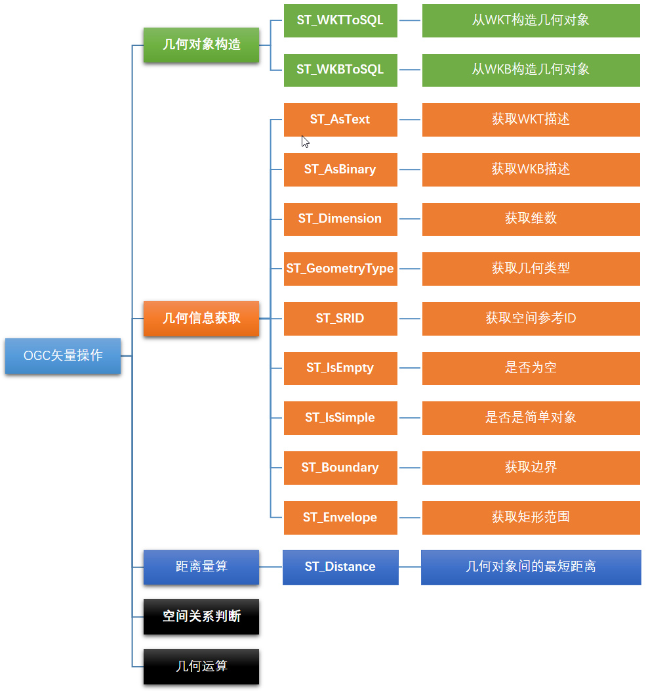

空间关系判断的一些定义：

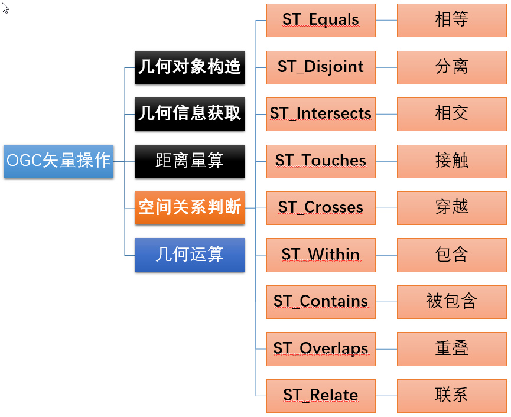

这些空间关系，返回的都是True/False。

最后就是空间几何运算：

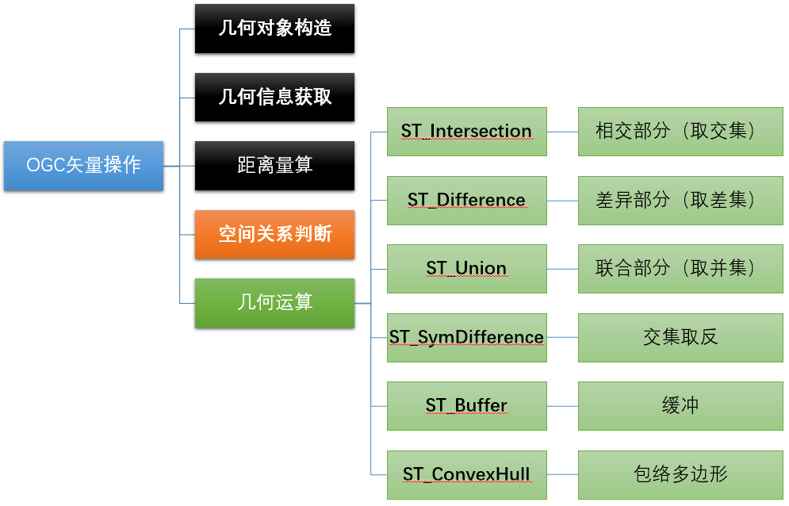

这些几何运算，会生成一个新的几何对象。

上面就是OGC规定的一些矢量数据的关系和运算规则，只要符合OGC标准的任意组织和单位做的空间算法，都将包含这些基本算法，而且经过千锤百炼的进化，我们也就没有必要自己再去写一套了。

这些算法，又如何实现呢？在OGC下面，一般又分为如下两个体系的实现：

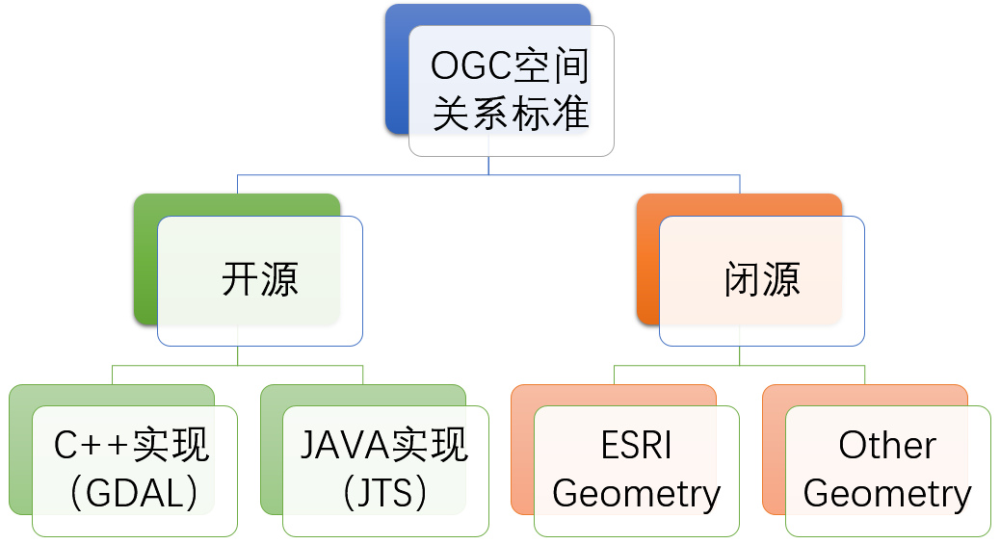

开源体系里面，一共有两种实现，第一种是业界使用的最广泛的GDAL，GDAL的全称是空间数据抽象库（Geospatial Data Abstraction Library），主要是用C++来实现的，这套体系里面，又衍生扩展出了无数的分支，比如PostGIS、Python GDAL/OGR，R语言的RGDAL包等。

另外一套就是JAVA体系下面的JTS（Java Topology Suite：Java拓扑套件），这一套包在GIS领域中的开源体系里面虽然名声不显，但是如果在非GIS专业里面，缺少大放异彩，在他下面衍生出来的空间应用包括了GeoServer这种开源WebGIS头把交椅的系统，Oracle Spatial这种企业级空间处理插件，包括了Spark下面用于空间处理的GeoSpark等等，都应用了JTS。

然后是闭源的系统，正如操作系统界一说闭源就是微软为代表，那么GIS界就是以ESRI为主要的标靶了。Esri在OGC标准下面开发了一整套几何关系算法，称之为Esri Geometry，功能除了上面OGC相关的标准以外，还有很多自行扩展的一些算法，几何组织模式也有一些不同，就以Esri的arcpy包而论，几何结构就表现为：

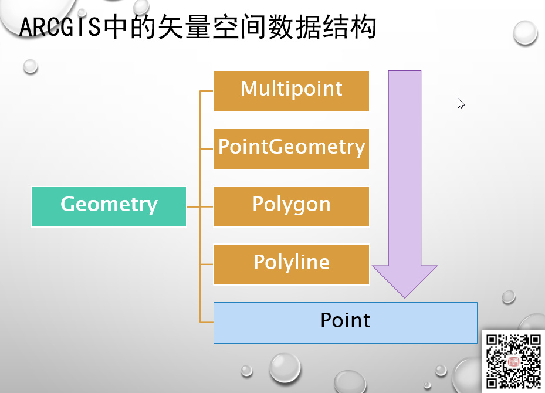

所有的几何结构，都以点为基准结构进行构造，几何点结构+空间关系，就变成了各种几何要素。这些几何要素包含了如下的属性：

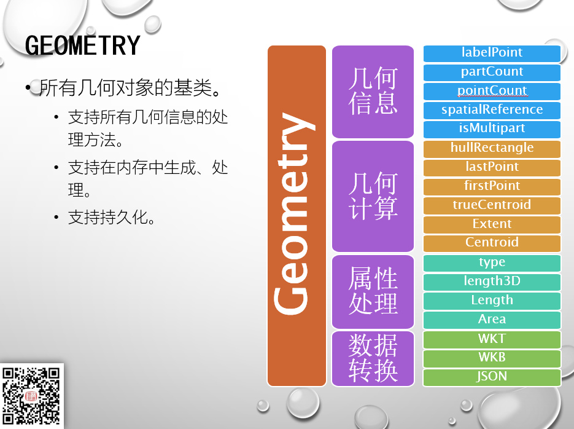

当然，也是包含了各种空间运算了，下面就是一部分：

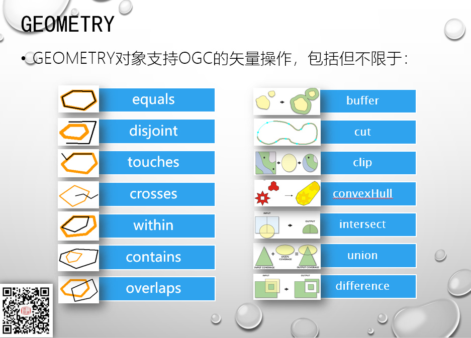

这些算法，单独拿出来非常容易理解，比如下面我们来做几个简单计算：
这里主要采用GDAL来实现：

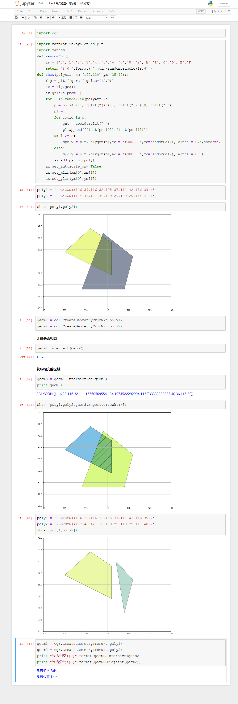

其他的方法，大家有兴趣自行查看API即可，我这里就不一一说明了。

这些空间算法如何在PySpark里面去使用呢？有一些什么条件呢？我们下一篇再说。

待续未完。
