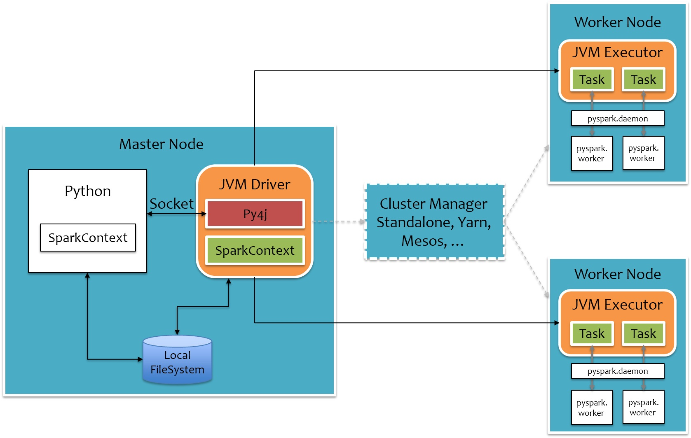
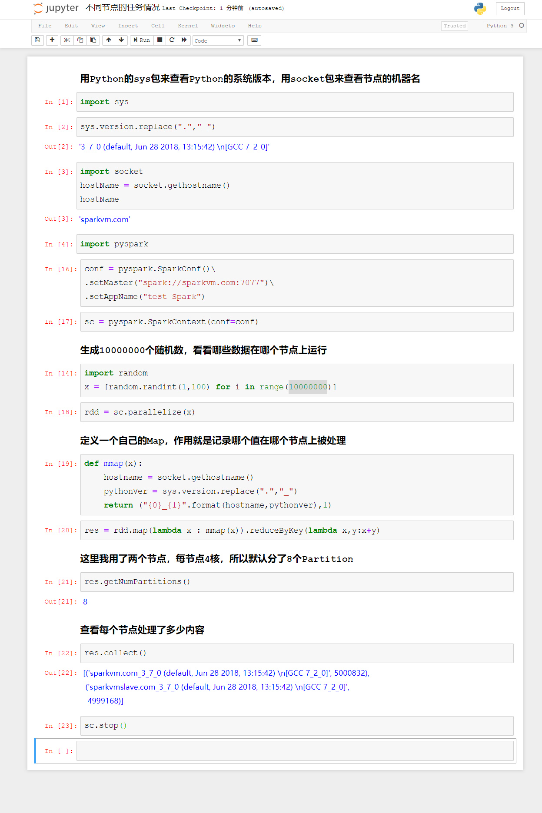
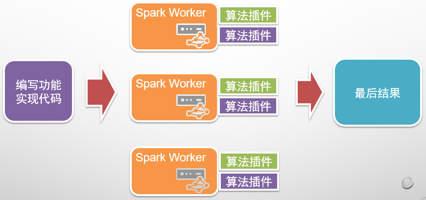
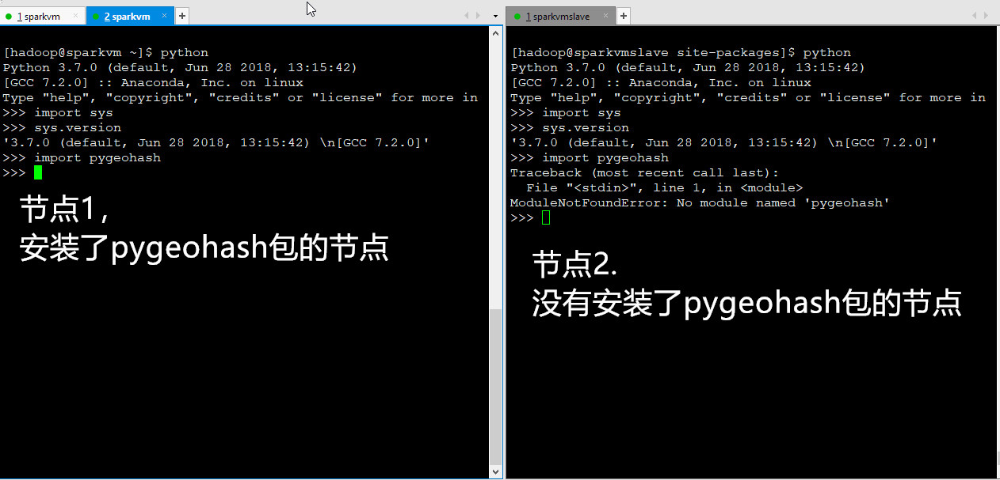
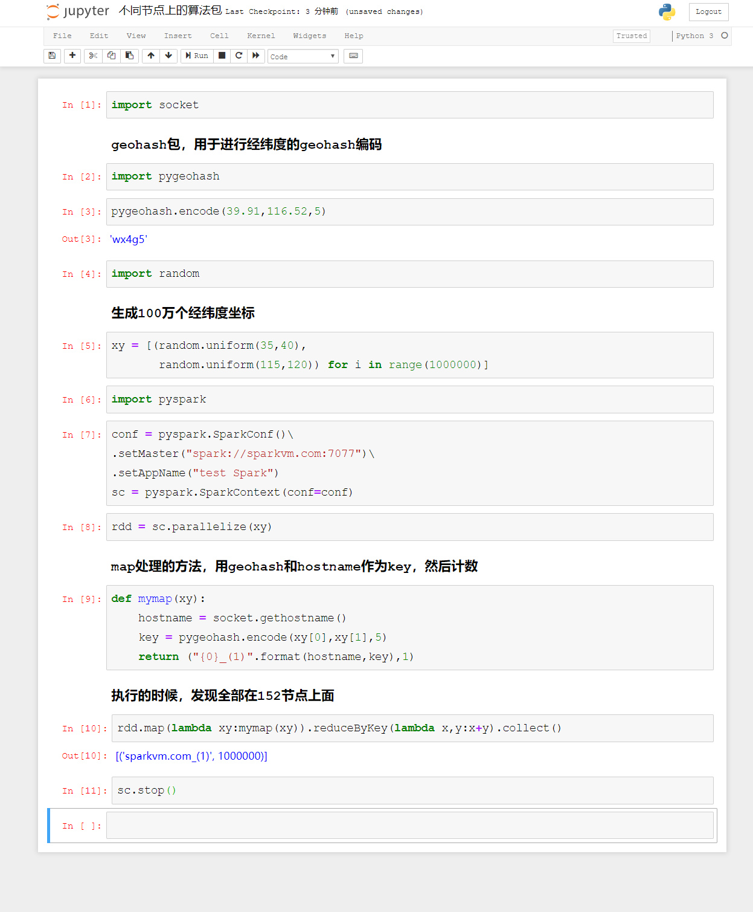
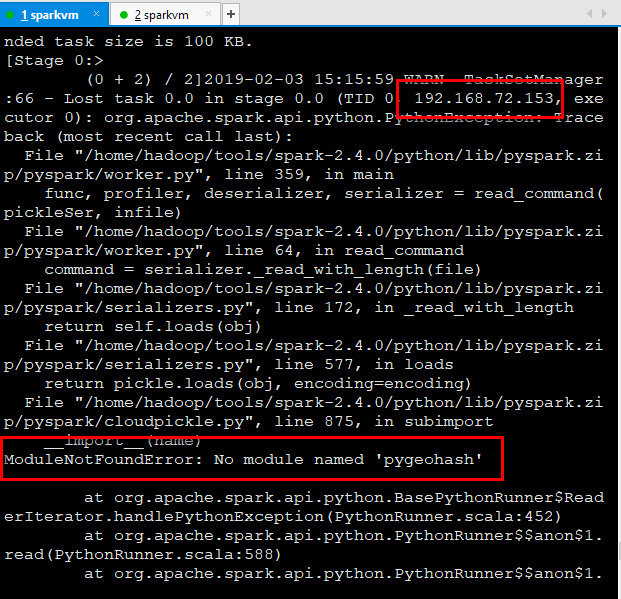
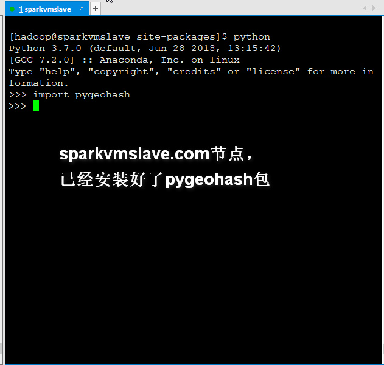
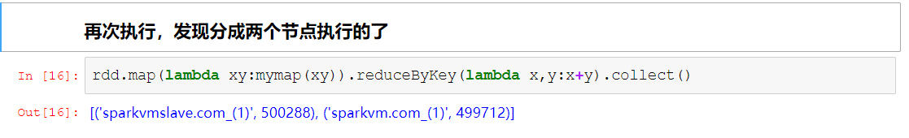
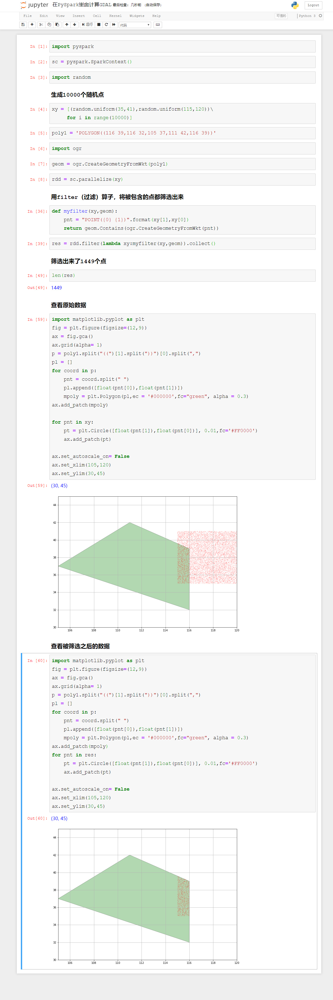

# PySpark算子处理空间数据全解析（5）：
# 如何在PySpark里面使用空间运算接口

Spark是分布式计算的，PySpark实际上是用Python调用了Spark的底层框架，那么这些个框架是如何调用的呢？上一篇说了一下Python里面利用GDAL包实现的空间算子，那么这些个整个调用流程是怎么样的呢？今天我们来一起探索一下。

本系列的第一篇文章就说过，要跑PySpark，需要用Py4J这个包，这个包的作用就是利用Python来调用Java虚拟机里面的对象，原理是这样的：

Python的算法通过Socket将任务发送给Java虚机，JAVA虚机通过Py4J这个包解析，然后调用Spark的Worker计算节点，再把任务还原成Python实现，执行完成之后，再反向走一遍。

具体的说明请查看这篇文章，我就不重复了：
http://sharkdtu.com/posts/pyspark-internal.html

可以看出来，用Python写的内容，最后再Worker端，也是用Python的算法或者包来进行实现，下面我们来做一个实验：

利用Python的sys包来查看运行的Python的版本，用socket包来查看节点的机器名，这两个包都是Python特有的，如果说PySpark仅仅运行的是Java的话，在不同节点上，应该是无法执行的。

我这里一共有两台机器，分别叫做sparkvm.com和sparkvmslave.com，其中Sparkvm.com是master + worker，而sparkvmslave.com仅仅是worker。

最后执行的表明，在不同的节点上返回了不同的结果。

从上面的实验可以看出，不同的计算节点上，最终使用的是Python的算法包，那么如何在不同的节点上使用空间分析算法呢？

在Spark上，利用的算法插件这种方式来实现：

只要在不同的节点上都安装同样的Python算法包，就可以执行了，关键点在于需要配置好系统的Python，因为PySpark默认调用的是系统的Python。

下面再做一个实验：

然后在PySpark上面在运行一个示例：

两个节点，为什么全部都在一个节点上执行呢？看看debug出来日志：

发现在153节点上，已经抛出了异常，说没有找到pygeohash包。

下面我在153上面，把pygeohash包安装上：

然后再次执行上面的内容：

最后我们来利用gdal的空间算法接口，来跑一个示例：

待续未完
