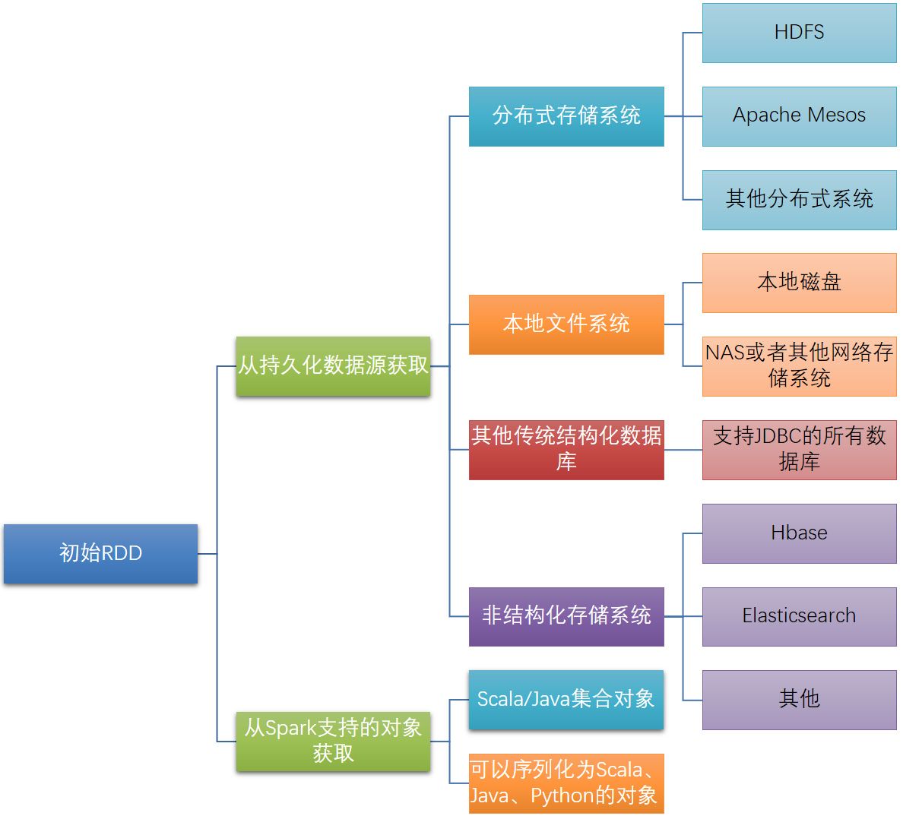
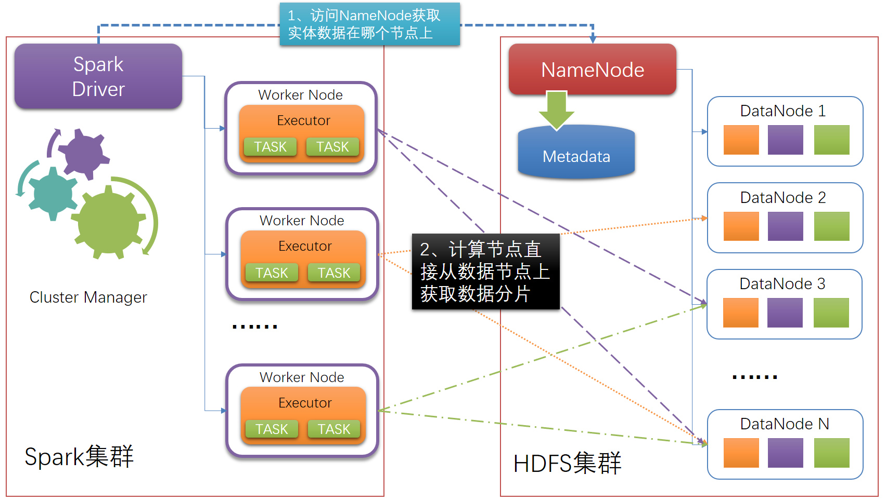
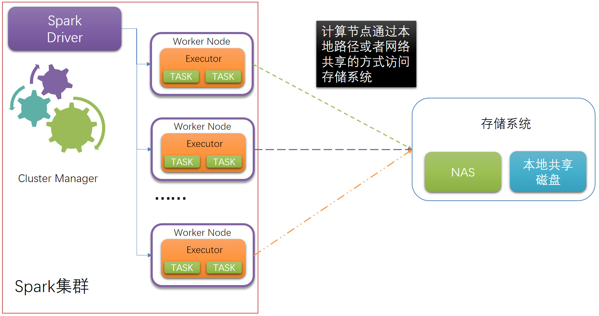
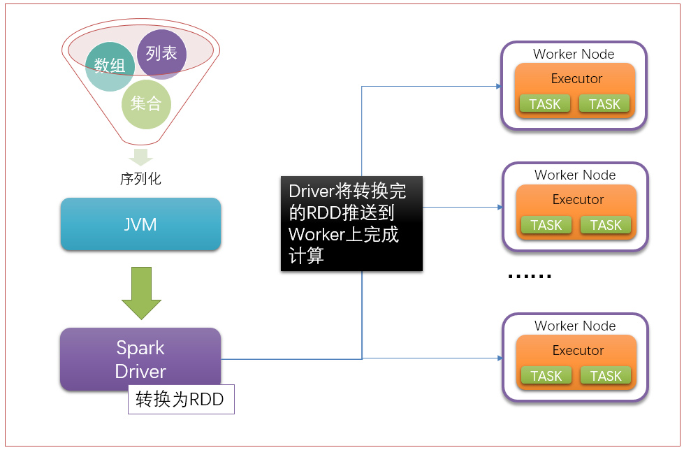
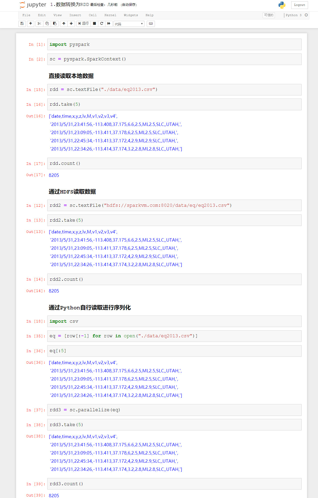
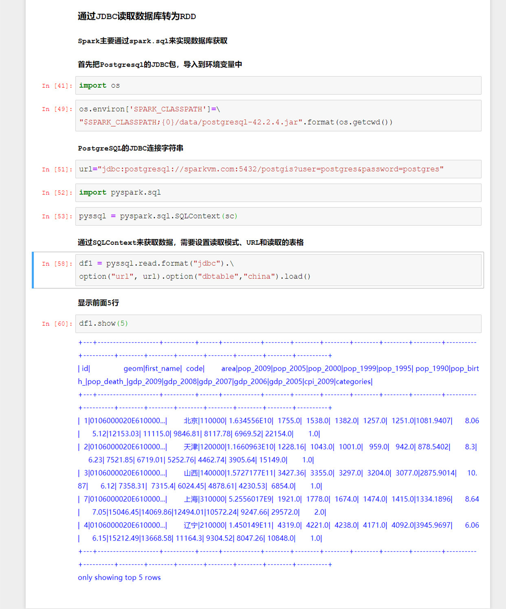

# PySpark算子处理空间数据全解析（6）：
# 数据生成算子

从本章开始讲各种算子，首先是最常用的算子，就是数据生成的算子。

开始我们讲过，RDD只能通过转换而来，而最早的RDD是怎么来的？那么先讲讲始祖RDD是怎么生成的。

最初始的RDD的获取方式如下：

主要是有两种来源模式，一是从持久化的数据源进行获取，Spark支持的数据源非常全面，几乎市面上能找到的持久化数据存储系统都可以支持，但是最常见的还是直接读取Hadoop的分布式文件系统HDFS和apache Mesos。

因为从分布式存储系统来获取数据，可以充分利用Spark分布式节点的优势，去多个进程去读取分布式存储节点上的数据，而且如果是HDFS的话，默认直接就会使用HDFS的数据分片作为Spark的任务大小分片，省去了很多任务调度和任务分配的开销。

结构化数据库和非结构化数据库（存储系统）的读取结构与HDFS集群读取是一样的，都是通过Driver进行控制分配，然后每个计算节点去计算去读取存储系统的内容，读取到Worker中，变成RDD。

而如果是本地磁盘的话，一般采用URL的方式，这样才能够让所有的Spark节点访问到数据位置，如果指定的是单机模式的话，那么会导致计算节点无法读取的异常。

通过上面两个架构的比较，可以发现，使用分布式存储系统，能够最大程度的利用分布式计算节点的优势，而共享存储的读取，就要受制于共享磁盘的访问效率了。

第二种就是从Spark支持的各种集合对象来转换。

通过JVM对数据进行读取，然后生成各种能够序列化对象集合，通过Spark Driver进行转换，变成RDD，然后把这些RDD推送到每个计算节点上。

这种方式能够获取的数据类型就更加广泛了，理论上只要Java、Spark、Python等语言能够读取并且序列化的对象集合，都可以转换为RDD。

但是这种模式，有一个致命的缺点：读取并且序列化的数据，不能超过Driver的内存大小。因为这种模式，是把所有数据全部读取进来，然后进行序列化并且传输的，如果你的要序列化的数据大小大于Driver的大小，那么就会出现内存溢出的问题。（当然，要解决这个问题，可以采用磁盘缓存等多种技术，这里暂时不聊这个）。

而采用前面分布式读取的方式，则不会出现这个问题，因为worker节点直接去获取数据，并且获取到的是一个个的数据块，不存在需要在Driver这一台机器上进行序列化的问题。

下面通过几个示例，来简单来看看如何从数据中获取到RDD。

Spark默认可以直接读取文本类型的文件，那么空间数据怎么变成RDD呢？我们下回分解

待续未完

