# PySpark算子处理空间数据全解析（7）：
# 构造空间数据的RDD（1）

Spark默认读取的是文本类型的文件，但是作为GISer，我们打交道的基本上都不是文本文件，无论是通用的Shapefile还是地理数据库，或者是栅格文件，都是以二进制为主的文件，那么在Spark里面怎么用呢？

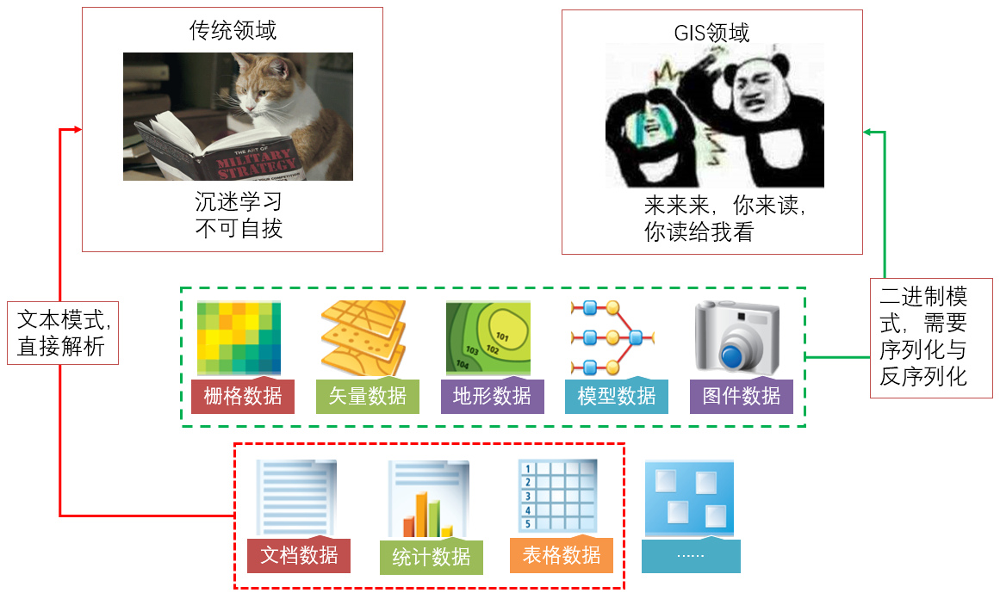

上一篇说过，可以通过对象序列化的方式来实现，比如先读成序列化对象，然后转换成RDD，比如下面这篇地类图斑：

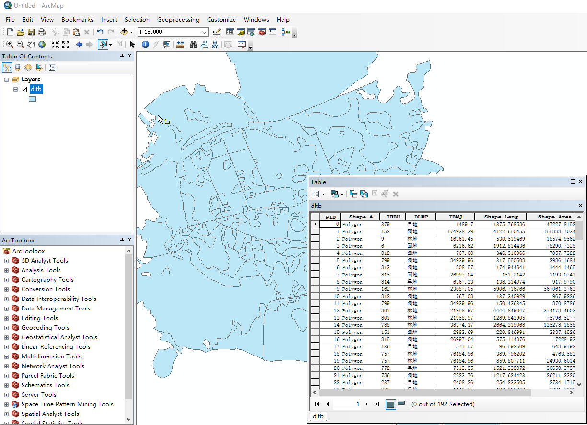

存储为Shapefile，如何变成RDD呢，通过对象序列化的方式来实现，代码如下：

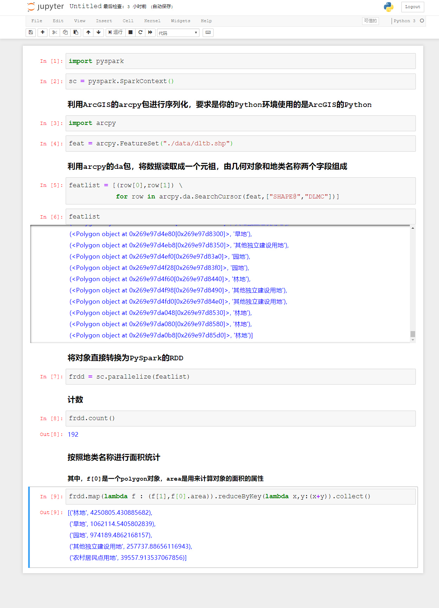

上面的例子里面，我们直接通过arcpy包，读取了shapefile里面的要素，把每一条数据简单取出构建成了一个由地类名称和几何要素组成的元祖，然后把这些元祖的集合直接转变成了RDD。

之后使用这个RDD就和使用普通RDD一样了，里面几何要素都的属性和方法都能直接使用。

这种方法能够序列化任意对象，只要你的Driver能够读取的数据，都能够变成RDD，但是问题昨天也说过了，如果你序列化的对象太大，超过了Driver节点的可用内存，那么可能会被撑爆：

那么如果要另外一种方式，比如你的数据是存放在HDFS上面的怎么办呢？还有，如果你的数据大小超过了Driver节点的可用内存又怎么办呢？

如果要去读取Shapefile，或者file gdb这种数据格式，就得说Spark对自定义格式数据的读取了，但是我们这里暂时不去说怎么复杂的东西，我们暂时先来看看一般情况下如何解决这个问题。

（ArcGIS Geoanalytics server有一套特有的API，可以把Shapefile读取成FeatureRDD，但是需要有ArcGIS GA的许可和API，我们这里主要说开源体系，所以这里暂时略过）。

那么怎么在仅能支持文本模式的默认情况下，读取空间数据呢？

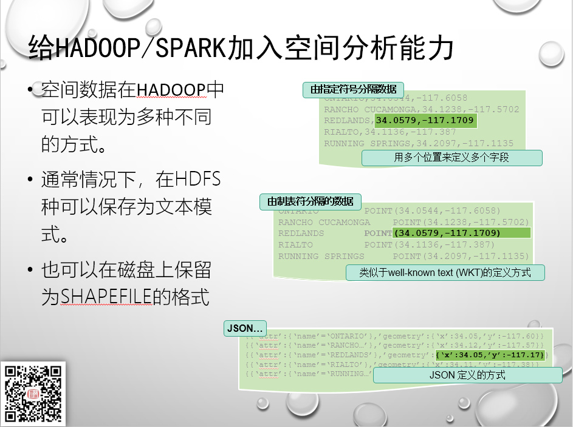

最简单的模式，就是直接把空间数据表达为文本模式，如果要表达的是点的话，仅需要定义x\y两个字段即可，比如我们的地震点位数据：

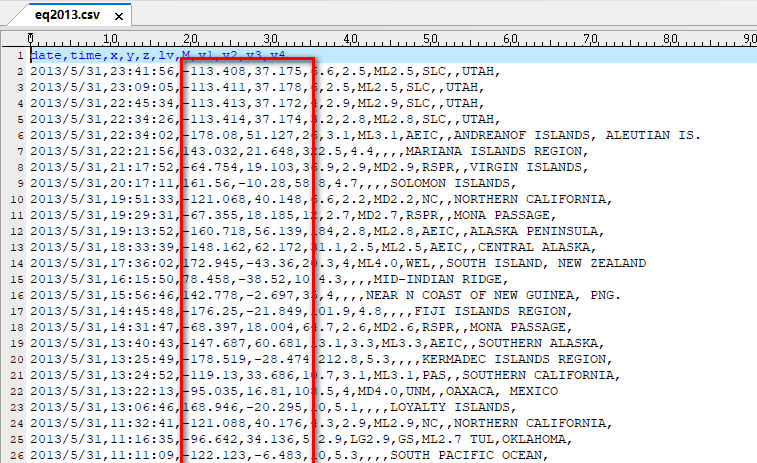

但是空间数据里面，还有大量带有拓扑结构的数据，比如线和面，那么就需要借助OGC规范定义的一些结构了，比如GeoJson：

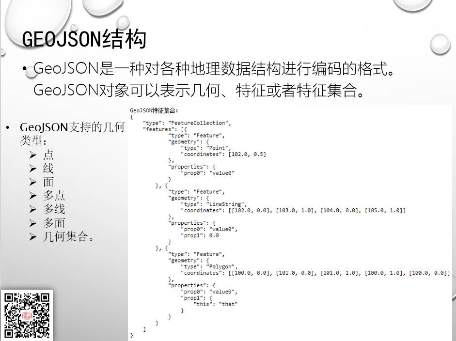

或者是WKB/WKT结构：

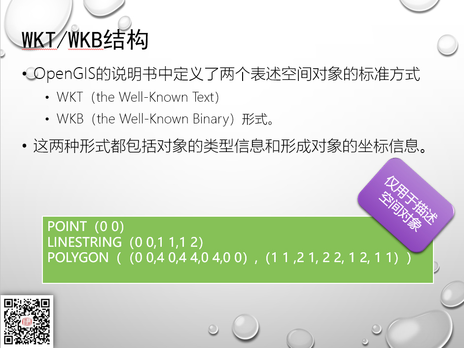

但是WKT仅能用于描述空间对象，附带这空间数据上面的那些属性数据怎么办呢？这样就可以采用csv/tsv格式来进行表达：

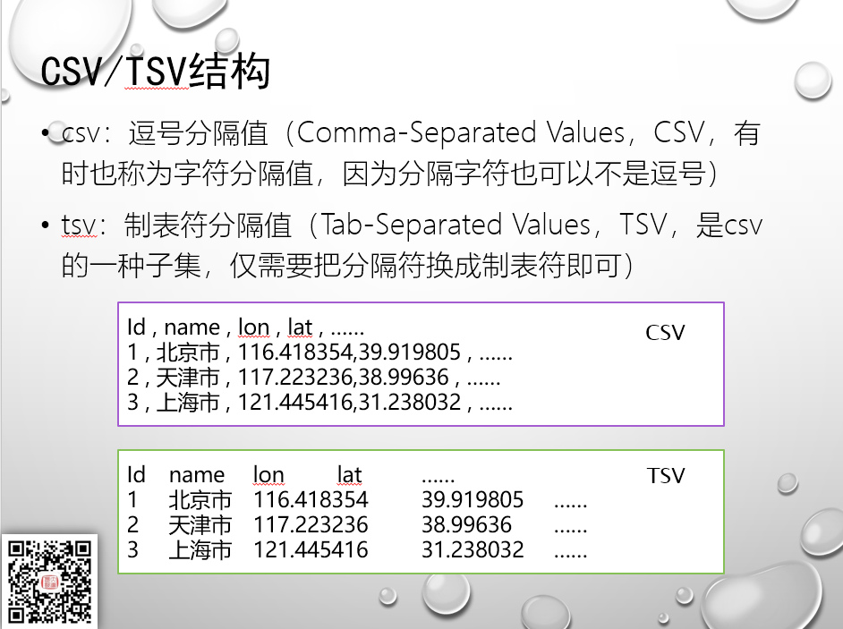

tsv结合wkt，就可以进行要素级别的表达了：

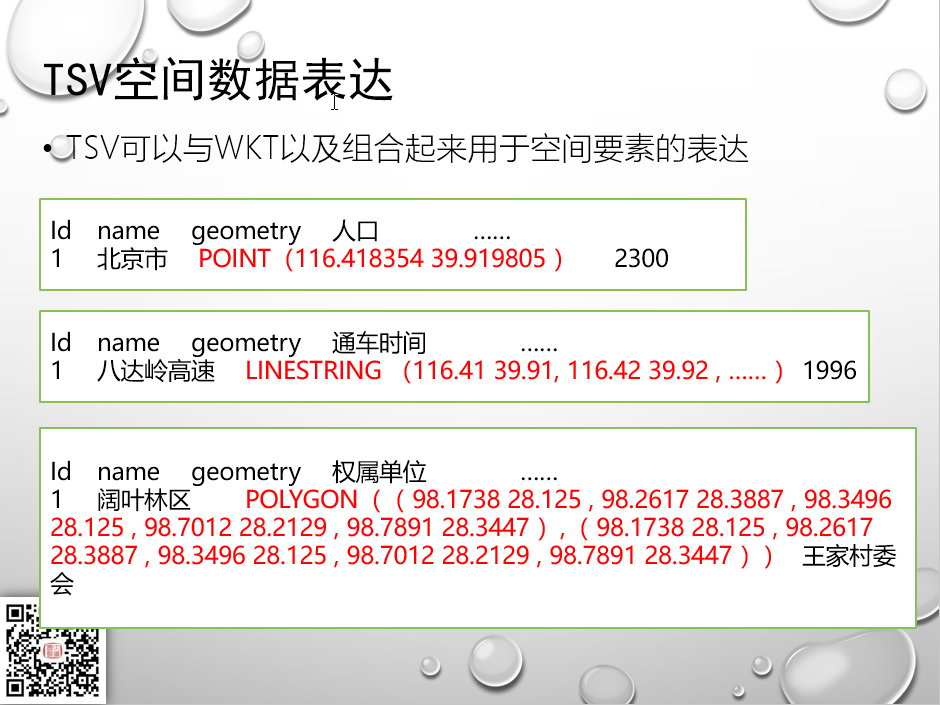

那么为什么不用csv来结合wkt呢？这里实际上大家也都看出来了，csv是用逗号来分割的，而wkt里面有大量的逗号，除非仅表达点数据，否则会破坏掉数据分割的标记。

而wkt + 属性字段的模式，也是标准的ogc可读空间数据表达模式，比如在PostGIS里面，直接就会表达为：

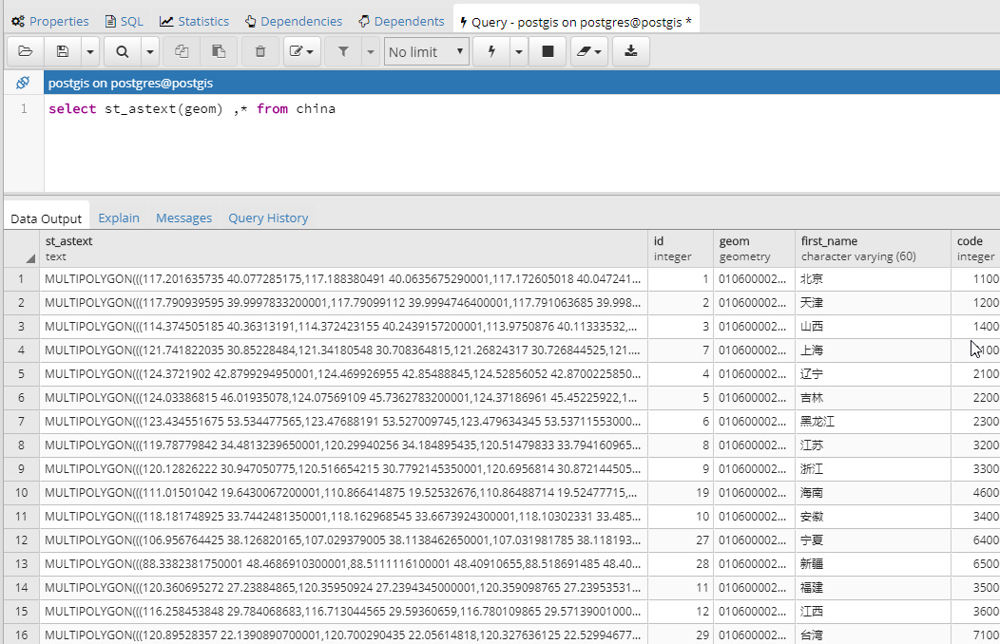

下面我们通过一个示例来说明如何将数据转换为文本模式数据（采用GDAL）：

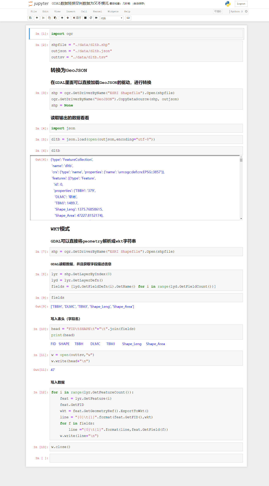

最后生成的tsv数据如下：

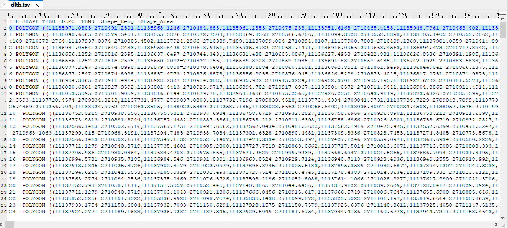

待续未完

需要代码的同学可以从我的github或者gitee上自行下载：

github:
https://github.com/allenlu2008/PySparkDemo

gitee:
https://gitee.com/godxia/PySparkDemo

